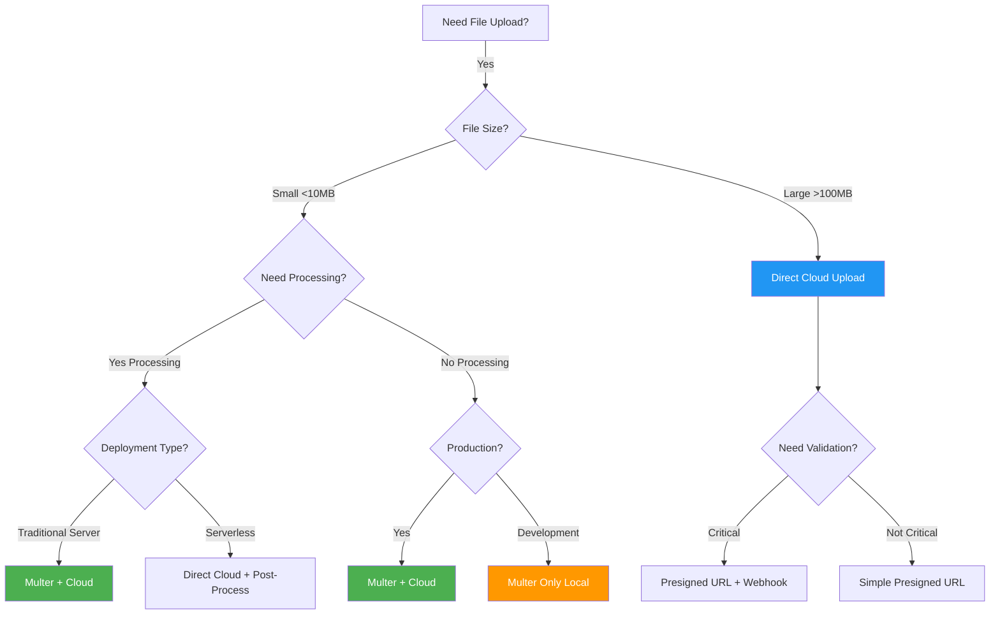
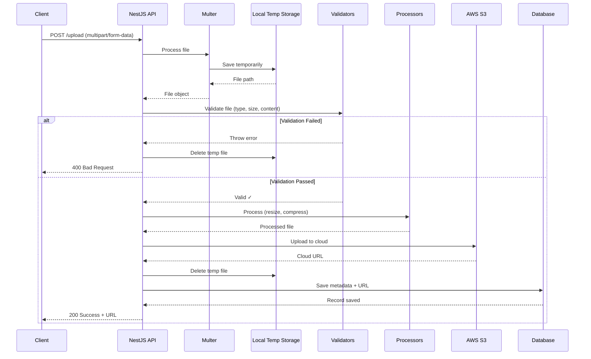

# Module 8: File Handling & Media

## 📚 Table of Contents

1. [Overview](#overview)
2. [Understanding File Upload Architectures](#understanding-file-upload-architectures)
3. [Multer vs Cloud Storage Decision Guide](#multer-vs-cloud-storage-decision-guide)
4. [Scenario 1: Multer WITH Cloud Storage](#scenario-1-multer-with-cloud-storage)
5. [Scenario 2: Direct Cloud Upload](#scenario-2-direct-cloud-upload)
6. [Scenario 3: Hybrid Upload Strategy](#scenario-3-hybrid-upload-strategy)
7. [Scenario 4: Image Processing Pipeline](#scenario-4-image-processing-pipeline)
8. [Scenario 5: Large File Upload with Chunking](#scenario-5-large-file-upload-with-chunking)
9. [Scenario 6: Multi-Cloud Strategy](#scenario-6-multi-cloud-strategy)
10. [Scenario 7: Virus Scanning Pipeline](#scenario-7-virus-scanning-pipeline)
11. [File Upload Setup](#file-upload-setup)
12. [Basic File Upload](#basic-file-upload)
13. [File Validation](#file-validation)
14. [Multiple File Upload](#multiple-file-upload)
15. [File Storage Options](#file-storage-options)
16. [AWS S3 Integration](#aws-s3-integration)
17. [Image Processing](#image-processing)
18. [File Download](#file-download)
19. [Streaming Files](#streaming-files)
20. [Best Practices](#best-practices)
21. [Mini Project: Media Management System](#mini-project-media-management-system)

---

## Overview

This module covers handling file uploads, downloads, and media processing in NestJS applications. You'll learn to upload files, validate them, store them securely, and integrate with cloud storage services.

**Topics Covered:**

- File upload handling
- File validation and security
- Local and cloud storage
- Image processing
- File streaming
- Download handling

---

## Understanding File Upload Architectures

Before diving into implementation, it's crucial to understand the different architectural patterns for file uploads and when to use each approach.

### The Three Main Components


#### **1. Multer**

- **What**: Middleware for handling `multipart/form-data` (file uploads)
- **Where**: Runs on your NestJS server
- **Purpose**: Receives files from HTTP requests and processes them
- **Storage**: Temporarily stores files (memory or disk)
- **Use Case**: First point of contact for incoming files

#### **2. Local Storage**

- **What**: Your server's filesystem or memory
- **Where**: On your application server
- **Purpose**: Temporary storage for processing, validation, or permanent storage for small apps
- **Limitation**: Doesn't scale horizontally, limited by server capacity

#### **3. Cloud Storage**

- **What**: External storage services (AWS S3, Google Cloud Storage, Azure Blob, Cloudinary)
- **Where**: Remote cloud infrastructure
- **Purpose**: Scalable, persistent, CDN-enabled storage
- **Advantage**: Unlimited capacity, global distribution, durability

---

## Multer vs Cloud Storage Decision Guide

### Architecture Decision Tree



### Decision Matrix

| **Criteria**         | **Multer + Cloud** | **Direct Cloud Upload** | **Multer Only**   |
| -------------------- | ------------------ | ----------------------- | ----------------- |
| **File Size**        | < 50MB ✅          | > 100MB ✅              | < 10MB ✅         |
| **Need Validation**  | ✅ Before upload   | ⚠️ After upload         | ✅ Before storage |
| **Need Processing**  | ✅ Easy            | ❌ Complex              | ✅ Easy           |
| **Production Ready** | ✅ Yes             | ✅ Yes                  | ❌ Dev only       |
| **Serverless**       | ❌ Limited         | ✅ Perfect              | ❌ No             |
| **Security**         | ✅ High            | ⚠️ Medium               | ✅ High           |
| **Scalability**      | ⚠️ Medium          | ✅ Unlimited            | ❌ Low            |
| **Cost**             | ⚠️ Bandwidth costs | ✅ Lower                | ✅ Storage only   |
| **Complexity**       | Medium             | Low                     | Low               |

### When to Use Each Pattern

#### ✅ **Use Multer WITH Cloud Storage when:**

1. Building standard CRUD applications
2. Need file validation **before** cloud storage
3. Need to process files (resize, compress, watermark)
4. Security is critical (virus scanning)
5. Files are < 50MB
6. Running on traditional servers/VMs
7. Need to generate multiple versions (thumbnails)
8. Want to optimize storage costs (validate first)

#### ✅ **Use Direct Cloud Upload when:**

1. Files are very large (> 100MB)
2. Using serverless architecture (Lambda, Vercel, Cloudflare Workers)
3. Need maximum scalability
4. Building mobile-first apps
5. Can validate files post-upload
6. Users are authenticated and trusted
7. Want to minimize server bandwidth usage

#### ✅ **Use Only Multer (Local Storage) when:**

1. Development/testing environment
2. Privacy requirements (no external cloud)
3. Processing temporary files (generated PDFs, conversions)
4. Self-hosted infrastructure
5. Very low traffic (<100 users)
6. Internal tools only

---

## Scenario 1: Multer WITH Cloud Storage

This is the **most common production pattern** where Multer and Cloud Storage work together.

### Architecture Flow



### Complete Implementation

#### Step 1: Install Dependencies

```bash
npm install @nestjs/platform-express multer
npm install @aws-sdk/client-s3
npm install sharp  # For image processing
npm install -D @types/multer
```

#### Step 2: Configure Environment Variables

```env
# .env
AWS_REGION=us-east-1
AWS_ACCESS_KEY_ID=your_access_key
AWS_SECRET_ACCESS_KEY=your_secret_key
AWS_S3_BUCKET=your-bucket-name
```

#### Step 3: Create S3 Service

```typescript
// src/files/services/s3.service.ts
import { Injectable, Logger } from "@nestjs/common";
import { ConfigService } from "@nestjs/config";
import {
  S3Client,
  PutObjectCommand,
  DeleteObjectCommand,
  GetObjectCommand,
} from "@aws-sdk/client-s3";
import { getSignedUrl } from "@aws-sdk/s3-request-presigner";
import * as fs from "fs";
import * as path from "path";

@Injectable()
export class S3Service {
  private readonly s3Client: S3Client;
  private readonly bucketName: string;
  private readonly logger = new Logger(S3Service.name);

  constructor(private configService: ConfigService) {
    this.s3Client = new S3Client({
      region: this.configService.get("AWS_REGION"),
      credentials: {
        accessKeyId: this.configService.get("AWS_ACCESS_KEY_ID"),
        secretAccessKey: this.configService.get("AWS_SECRET_ACCESS_KEY"),
      },
    });

    this.bucketName = this.configService.get("AWS_S3_BUCKET");
  }

  /**
   * Upload file from local path to S3
   * @param filePath - Local file path
   * @param key - S3 object key (path in bucket)
   * @param contentType - MIME type
   * @returns S3 URL
   */
  async uploadFile(
    filePath: string,
    key: string,
    contentType: string
  ): Promise<string> {
    try {
      // Read file content
      const fileContent = fs.readFileSync(filePath);

      // Upload to S3
      const command = new PutObjectCommand({
        Bucket: this.bucketName,
        Key: key,
        Body: fileContent,
        ContentType: contentType,
        // ACL: 'public-read', // Uncomment if you want public access
      });

      await this.s3Client.send(command);

      // Return S3 URL
      const url = `https://${this.bucketName}.s3.amazonaws.com/${key}`;
      this.logger.log(`File uploaded to S3: ${url}`);

      return url;
    } catch (error) {
      this.logger.error(`Failed to upload to S3: ${error.message}`);
      throw new Error(`S3 upload failed: ${error.message}`);
    }
  }

  /**
   * Upload buffer directly to S3 (for memory storage)
   * @param buffer - File buffer
   * @param key - S3 object key
   * @param contentType - MIME type
   * @returns S3 URL
   */
  async uploadBuffer(
    buffer: Buffer,
    key: string,
    contentType: string
  ): Promise<string> {
    try {
      const command = new PutObjectCommand({
        Bucket: this.bucketName,
        Key: key,
        Body: buffer,
        ContentType: contentType,
      });

      await this.s3Client.send(command);
      return `https://${this.bucketName}.s3.amazonaws.com/${key}`;
    } catch (error) {
      this.logger.error(`Failed to upload buffer to S3: ${error.message}`);
      throw new Error(`S3 buffer upload failed: ${error.message}`);
    }
  }

  /**
   * Generate presigned URL for temporary access
   * @param key - S3 object key
   * @param expiresIn - Expiration time in seconds (default 1 hour)
   * @returns Presigned URL
   */
  async getSignedUrl(key: string, expiresIn: number = 3600): Promise<string> {
    const command = new GetObjectCommand({
      Bucket: this.bucketName,
      Key: key,
    });

    return await getSignedUrl(this.s3Client, command, { expiresIn });
  }

  /**
   * Delete file from S3
   * @param key - S3 object key
   */
  async deleteFile(key: string): Promise<void> {
    try {
      const command = new DeleteObjectCommand({
        Bucket: this.bucketName,
        Key: key,
      });

      await this.s3Client.send(command);
      this.logger.log(`File deleted from S3: ${key}`);
    } catch (error) {
      this.logger.error(`Failed to delete from S3: ${error.message}`);
      throw new Error(`S3 delete failed: ${error.message}`);
    }
  }
}
```

#### Step 4: Create Image Processing Service

```typescript
// src/files/services/image-processing.service.ts
import { Injectable, Logger } from "@nestjs/common";
import * as sharp from "sharp";
import * as path from "path";

export interface ProcessedImages {
  original: string;
  large: string;
  medium: string;
  thumbnail: string;
}

@Injectable()
export class ImageProcessingService {
  private readonly logger = new Logger(ImageProcessingService.name);

  /**
   * Process image into multiple sizes
   * @param inputPath - Input file path
   * @param outputDir - Output directory
   * @param baseFilename - Base filename (without extension)
   * @returns Paths to all processed images
   */
  async processImage(
    inputPath: string,
    outputDir: string,
    baseFilename: string
  ): Promise<ProcessedImages> {
    try {
      const paths: ProcessedImages = {
        original: inputPath,
        large: path.join(outputDir, `${baseFilename}-large.jpg`),
        medium: path.join(outputDir, `${baseFilename}-medium.jpg`),
        thumbnail: path.join(outputDir, `${baseFilename}-thumb.jpg`),
      };

      // Process all sizes in parallel
      await Promise.all([
        // Large: 1920x1080, 85% quality
        sharp(inputPath)
          .resize(1920, 1080, {
            fit: "inside",
            withoutEnlargement: true,
          })
          .jpeg({ quality: 85 })
          .toFile(paths.large),

        // Medium: 800x600, 80% quality
        sharp(inputPath)
          .resize(800, 600, {
            fit: "inside",
            withoutEnlargement: true,
          })
          .jpeg({ quality: 80 })
          .toFile(paths.medium),

        // Thumbnail: 300x300, 75% quality, cover fit
        sharp(inputPath)
          .resize(300, 300, {
            fit: "cover",
            position: "center",
          })
          .jpeg({ quality: 75 })
          .toFile(paths.thumbnail),
      ]);

      this.logger.log(`Image processed: ${baseFilename}`);
      return paths;
    } catch (error) {
      this.logger.error(`Image processing failed: ${error.message}`);
      throw new Error(`Image processing failed: ${error.message}`);
    }
  }

  /**
   * Compress image
   * @param inputPath - Input file path
   * @param outputPath - Output file path
   * @param quality - Quality (1-100)
   */
  async compressImage(
    inputPath: string,
    outputPath: string,
    quality: number = 85
  ): Promise<void> {
    await sharp(inputPath).jpeg({ quality }).toFile(outputPath);
  }

  /**
   * Resize image to specific dimensions
   */
  async resizeImage(
    inputPath: string,
    outputPath: string,
    width: number,
    height: number
  ): Promise<void> {
    await sharp(inputPath)
      .resize(width, height, {
        fit: "inside",
        withoutEnlargement: true,
      })
      .toFile(outputPath);
  }
}
```

#### Step 5: Create File Entity

```typescript
// src/files/entities/file.entity.ts
import {
  Entity,
  PrimaryGeneratedColumn,
  Column,
  CreateDateColumn,
  UpdateDateColumn,
} from "typeorm";

export enum FileStorageType {
  LOCAL = "local",
  S3 = "s3",
  CLOUDINARY = "cloudinary",
}

@Entity("files")
export class File {
  @PrimaryGeneratedColumn("uuid")
  id: string;

  @Column()
  originalName: string;

  @Column()
  filename: string;

  @Column()
  path: string; // Local path or S3 URL

  @Column({ nullable: true })
  s3Key: string; // S3 object key

  @Column({ type: "bigint" })
  size: number;

  @Column()
  mimetype: string;

  @Column({
    type: "enum",
    enum: FileStorageType,
    default: FileStorageType.LOCAL,
  })
  storage: FileStorageType;

  @Column({ nullable: true })
  thumbnailPath: string;

  @Column({ nullable: true })
  mediumPath: string;

  @Column({ nullable: true })
  largePath: string;

  @CreateDateColumn()
  createdAt: Date;

  @UpdateDateColumn()
  updatedAt: Date;
}
```

#### Step 6: Create Files Service

```typescript
// src/files/files.service.ts
import { Injectable, NotFoundException, Logger } from "@nestjs/common";
import { InjectRepository } from "@nestjs/typeorm";
import { Repository } from "typeorm";
import { File, FileStorageType } from "./entities/file.entity";
import { S3Service } from "./services/s3.service";
import { ImageProcessingService } from "./services/image-processing.service";
import * as fs from "fs";
import * as path from "path";

@Injectable()
export class FilesService {
  private readonly logger = new Logger(FilesService.name);

  constructor(
    @InjectRepository(File)
    private filesRepository: Repository<File>,
    private s3Service: S3Service,
    private imageProcessingService: ImageProcessingService
  ) {}

  /**
   * Upload file to S3 with processing
   * Pattern: Multer → Local Temp → Process → S3 → Cleanup
   */
  async uploadToS3WithProcessing(file: Express.Multer.File): Promise<File> {
    try {
      // 1. File is already saved locally by Multer
      this.logger.log(`Processing file: ${file.originalname}`);

      // 2. Validate file (additional validation beyond Multer)
      await this.validateFile(file);

      // 3. Process image if it's an image
      const isImage = file.mimetype.startsWith("image/");
      let processedPaths = null;

      if (isImage) {
        const baseFilename = path.parse(file.filename).name;
        const outputDir = path.dirname(file.path);

        processedPaths = await this.imageProcessingService.processImage(
          file.path,
          outputDir,
          baseFilename
        );
      }

      // 4. Upload to S3
      const s3Key = `uploads/${Date.now()}-${file.originalname}`;
      const s3Url = await this.s3Service.uploadFile(
        isImage ? processedPaths.large : file.path,
        s3Key,
        file.mimetype
      );

      // 5. Upload additional sizes if image
      let thumbnailUrl, mediumUrl, largeUrl;
      if (isImage && processedPaths) {
        [thumbnailUrl, mediumUrl, largeUrl] = await Promise.all([
          this.s3Service.uploadFile(
            processedPaths.thumbnail,
            `uploads/thumbs/${Date.now()}-${file.originalname}`,
            file.mimetype
          ),
          this.s3Service.uploadFile(
            processedPaths.medium,
            `uploads/medium/${Date.now()}-${file.originalname}`,
            file.mimetype
          ),
          this.s3Service.uploadFile(processedPaths.large, s3Key, file.mimetype),
        ]);
      }

      // 6. Save to database
      const fileRecord = this.filesRepository.create({
        originalName: file.originalname,
        filename: file.filename,
        path: s3Url,
        s3Key: s3Key,
        size: file.size,
        mimetype: file.mimetype,
        storage: FileStorageType.S3,
        thumbnailPath: thumbnailUrl,
        mediumPath: mediumUrl,
        largePath: largeUrl,
      });

      const savedFile = await this.filesRepository.save(fileRecord);

      // 7. Cleanup local files
      await this.cleanupLocalFiles(file.path, processedPaths);

      this.logger.log(`File uploaded successfully: ${savedFile.id}`);
      return savedFile;
    } catch (error) {
      this.logger.error(`Upload failed: ${error.message}`);
      // Cleanup on error
      if (fs.existsSync(file.path)) {
        fs.unlinkSync(file.path);
      }
      throw error;
    }
  }

  /**
   * Additional file validation
   */
  private async validateFile(file: Express.Multer.File): Promise<void> {
    // Check file actually exists
    if (!fs.existsSync(file.path)) {
      throw new Error("File not found after upload");
    }

    // Validate file size again (redundant but safe)
    const stats = fs.statSync(file.path);
    if (stats.size > 50 * 1024 * 1024) {
      // 50MB
      throw new Error("File too large");
    }

    // More validations can be added here:
    // - Virus scanning
    // - Content-based file type detection
    // - Image dimension checks
    // - etc.
  }

  /**
   * Cleanup temporary local files
   */
  private async cleanupLocalFiles(
    originalPath: string,
    processedPaths: any
  ): Promise<void> {
    try {
      // Delete original temp file
      if (fs.existsSync(originalPath)) {
        fs.unlinkSync(originalPath);
      }

      // Delete processed files
      if (processedPaths) {
        for (const key of Object.keys(processedPaths)) {
          const filePath = processedPaths[key];
          if (fs.existsSync(filePath) && filePath !== originalPath) {
            fs.unlinkSync(filePath);
          }
        }
      }

      this.logger.log("Local temp files cleaned up");
    } catch (error) {
      this.logger.warn(`Cleanup warning: ${error.message}`);
    }
  }

  /**
   * Find file by ID
   */
  async findOne(id: string): Promise<File> {
    const file = await this.filesRepository.findOne({ where: { id } });

    if (!file) {
      throw new NotFoundException(`File with ID ${id} not found`);
    }

    return file;
  }

  /**
   * Delete file (from S3 and database)
   */
  async remove(id: string): Promise<void> {
    const file = await this.findOne(id);

    // Delete from S3 if stored there
    if (file.storage === FileStorageType.S3 && file.s3Key) {
      await this.s3Service.deleteFile(file.s3Key);

      // Delete other sizes
      if (file.thumbnailPath) {
        const thumbKey = this.extractS3Key(file.thumbnailPath);
        await this.s3Service.deleteFile(thumbKey);
      }
      if (file.mediumPath) {
        const mediumKey = this.extractS3Key(file.mediumPath);
        await this.s3Service.deleteFile(mediumKey);
      }
    }

    // Delete from database
    await this.filesRepository.delete(id);
    this.logger.log(`File deleted: ${id}`);
  }

  /**
   * Extract S3 key from URL
   */
  private extractS3Key(url: string): string {
    return url.split(".com/")[1];
  }
}
```

#### Step 7: Create Controller

```typescript
// src/files/files.controller.ts
import {
  Controller,
  Post,
  Get,
  Delete,
  Param,
  UseInterceptors,
  UploadedFile,
  ParseFilePipe,
  MaxFileSizeValidator,
  FileTypeValidator,
  HttpStatus,
  HttpCode,
} from "@nestjs/common";
import { FileInterceptor } from "@nestjs/platform-express";
import { FilesService } from "./files.service";
import { diskStorage } from "multer";
import { extname } from "path";

@Controller("files")
export class FilesController {
  constructor(private readonly filesService: FilesService) {}

  /**
   * Upload file with Multer → Process → S3 pattern
   *
   * Flow:
   * 1. Client uploads file
   * 2. Multer saves to local temp storage
   * 3. Validation runs
   * 4. File is processed (if image)
   * 5. File is uploaded to S3
   * 6. Temp files are cleaned up
   * 7. Metadata saved to database
   */
  @Post("upload")
  @HttpCode(HttpStatus.CREATED)
  @UseInterceptors(
    FileInterceptor("file", {
      storage: diskStorage({
        destination: "./temp-uploads",
        filename: (req, file, cb) => {
          const uniqueSuffix = `${Date.now()}-${Math.round(
            Math.random() * 1e9
          )}`;
          const ext = extname(file.originalname);
          cb(null, `${file.fieldname}-${uniqueSuffix}${ext}`);
        },
      }),
    })
  )
  async uploadFile(
    @UploadedFile(
      new ParseFilePipe({
        validators: [
          new MaxFileSizeValidator({ maxSize: 50 * 1024 * 1024 }), // 50MB
          new FileTypeValidator({
            fileType: /(jpg|jpeg|png|gif|webp|pdf|doc|docx)$/,
          }),
        ],
      })
    )
    file: Express.Multer.File
  ) {
    const uploadedFile = await this.filesService.uploadToS3WithProcessing(file);

    return {
      message: "File uploaded successfully",
      file: {
        id: uploadedFile.id,
        originalName: uploadedFile.originalName,
        size: uploadedFile.size,
        mimetype: uploadedFile.mimetype,
        url: uploadedFile.path,
        thumbnail: uploadedFile.thumbnailPath,
        medium: uploadedFile.mediumPath,
        large: uploadedFile.largePath,
      },
    };
  }

  /**
   * Get file metadata
   */
  @Get(":id")
  async getFile(@Param("id") id: string) {
    return await this.filesService.findOne(id);
  }

  /**
   * Delete file
   */
  @Delete(":id")
  @HttpCode(HttpStatus.NO_CONTENT)
  async deleteFile(@Param("id") id: string) {
    await this.filesService.remove(id);
  }
}
```

#### Step 8: Create Module

```typescript
// src/files/files.module.ts
import { Module } from "@nestjs/common";
import { TypeOrmModule } from "@nestjs/typeorm";
import { ConfigModule } from "@nestjs/config";
import { FilesController } from "./files.controller";
import { FilesService } from "./files.service";
import { S3Service } from "./services/s3.service";
import { ImageProcessingService } from "./services/image-processing.service";
import { File } from "./entities/file.entity";

@Module({
  imports: [TypeOrmModule.forFeature([File]), ConfigModule],
  controllers: [FilesController],
  providers: [FilesService, S3Service, ImageProcessingService],
  exports: [FilesService, S3Service],
})
export class FilesModule {}
```

### Why This Pattern?

**Advantages:**
✅ **Validation before cloud costs**: Only upload valid files  
✅ **Processing before storage**: Optimize images before S3  
✅ **Security**: Scan files before they reach cloud  
✅ **Cost optimization**: Don't pay for invalid uploads  
✅ **Flexibility**: Can target multiple cloud providers  
✅ **Error handling**: Clean up if upload fails

**Disadvantages:**
⚠️ **Server bandwidth**: File goes through your server  
⚠️ **Server storage**: Needs temp space  
⚠️ **Scale limits**: Limited by server capacity

**Best for:**

- Standard web applications
- E-commerce product images
- Profile picture uploads
- Document management systems
- Any app requiring processing or validation

---

## Scenario 2: Direct Cloud Upload

### Install Dependencies

```bash
npm install @nestjs/platform-express multer
```

---

## File Upload Setup

### Install Dependencies

```bash
npm install @nestjs/platform-express multer
npm install -D @types/multer
```

**Why Multer?**

- Multer is a middleware for handling `multipart/form-data` (file uploads)
- It's the standard for file uploads in Express/NestJS
- Handles file streams efficiently
- Supports multiple files and custom storage

### Configure Multer

Multer is configured per-route, but we'll set up reusable configurations:

```typescript
// src/config/multer.config.ts
import { MulterOptions } from "@nestjs/platform-express/multer/interfaces/multer-options.interface";
import { diskStorage } from "multer";
import { extname } from "path";
import { existsSync, mkdirSync } from "fs";

// Helper function to create upload directories if they don't exist
function createUploadDir(path: string) {
  if (!existsSync(path)) {
    mkdirSync(path, { recursive: true });
  }
}

// Configuration for image uploads
export const imageUploadConfig: MulterOptions = {
  // diskStorage stores files on the local filesystem
  // For production, consider using memoryStorage() and uploading to S3
  storage: diskStorage({
    // destination: Where to store uploaded files
    destination: (req, file, cb) => {
      const uploadPath = "./uploads/images";
      createUploadDir(uploadPath);
      cb(null, uploadPath);
    },

    // filename: How to name the uploaded file
    filename: (req, file, cb) => {
      // Generate unique filename to prevent collisions
      const uniqueSuffix = Date.now() + "-" + Math.round(Math.random() * 1e9);

      // Get original file extension
      const ext = extname(file.originalname);

      // Create filename: timestamp-random.extension
      const filename = `${file.fieldname}-${uniqueSuffix}${ext}`;
      cb(null, filename);
    },
  }),

  // fileFilter: Validate files before accepting them
  fileFilter: (req, file, cb) => {
    // Only allow image files
    if (file.mimetype.match(/\/(jpg|jpeg|png|gif|webp)$/)) {
      cb(null, true); // Accept file
    } else {
      cb(new Error("Only image files are allowed!"), false); // Reject file
    }
  },

  // limits: Set file size and count limits
  limits: {
    fileSize: 5 * 1024 * 1024, // 5MB max file size
    files: 1, // Maximum 1 file per request
  },
};

// Configuration for document uploads
export const documentUploadConfig: MulterOptions = {
  storage: diskStorage({
    destination: "./uploads/documents",
    filename: (req, file, cb) => {
      const uniqueSuffix = Date.now() + "-" + Math.round(Math.random() * 1e9);
      const ext = extname(file.originalname);
      const filename = `${file.fieldname}-${uniqueSuffix}${ext}`;
      cb(null, filename);
    },
  }),
  fileFilter: (req, file, cb) => {
    // Allow PDF, Word, Excel files
    const allowedMimes = [
      "application/pdf",
      "application/msword",
      "application/vnd.openxmlformats-officedocument.wordprocessingml.document",
      "application/vnd.ms-excel",
      "application/vnd.openxmlformats-officedocument.spreadsheetml.sheet",
    ];

    if (allowedMimes.includes(file.mimetype)) {
      cb(null, true);
    } else {
      cb(
        new Error(
          "Invalid file type. Only PDF, Word, and Excel files are allowed."
        ),
        false
      );
    }
  },
  limits: {
    fileSize: 10 * 1024 * 1024, // 10MB for documents
  },
};
```

---

## Basic File Upload

### Single File Upload

Handle a single file upload with validation:

```typescript
// src/files/files.controller.ts
import {
  Controller,
  Post,
  UseInterceptors,
  UploadedFile,
  ParseFilePipe,
  MaxFileSizeValidator,
  FileTypeValidator,
} from "@nestjs/common";
import { FileInterceptor } from "@nestjs/platform-express";
import { FilesService } from "./files.service";

@Controller("files")
export class FilesController {
  constructor(private readonly filesService: FilesService) {}

  // @Post('upload') - Endpoint for file upload
  // @UseInterceptors(FileInterceptor('file')) - Interceptor for single file
  // 'file' is the field name in the form data
  @Post("upload")
  @UseInterceptors(FileInterceptor("file"))
  async uploadFile(
    // @UploadedFile() extracts the uploaded file from the request
    // ParseFilePipe validates the file before it reaches the handler
    @UploadedFile(
      new ParseFilePipe({
        // validators: Array of validators to check
        validators: [
          // MaxFileSizeValidator: Check file size
          // 5MB maximum
          new MaxFileSizeValidator({ maxSize: 5 * 1024 * 1024 }),

          // FileTypeValidator: Check file type by MIME type
          // Only allow image MIME types
          new FileTypeValidator({ fileType: /(jpg|jpeg|png|gif|webp)/ }),
        ],
      })
    )
    file: Express.Multer.File
  ) {
    // file object contains:
    // - fieldname: The form field name
    // - originalname: Original filename
    // - encoding: File encoding
    // - mimetype: MIME type (e.g., 'image/jpeg')
    // - size: File size in bytes
    // - destination: Where file was saved
    // - filename: Generated filename
    // - path: Full path to the file

    console.log("File uploaded:", {
      originalName: file.originalname,
      filename: file.filename,
      size: file.size,
      mimetype: file.mimetype,
      path: file.path,
    });

    // Save file metadata to database
    const fileRecord = await this.filesService.create({
      originalName: file.originalname,
      filename: file.filename,
      path: file.path,
      size: file.size,
      mimetype: file.mimetype,
    });

    return {
      message: "File uploaded successfully",
      file: fileRecord,
      url: `/files/${fileRecord.id}`, // URL to access the file
    };
  }
}
```

**Understanding the File Object:**

- `originalname`: The name provided by the user
- `filename`: The generated unique filename
- `path`: Full filesystem path
- `mimetype`: Detected file type
- `size`: File size in bytes

### File Service

```typescript
// src/files/files.service.ts
import { Injectable } from "@nestjs/common";
import { InjectRepository } from "@nestjs/typeorm";
import { Repository } from "typeorm";
import { File } from "./entities/file.entity";

@Injectable()
export class FilesService {
  constructor(
    @InjectRepository(File)
    private filesRepository: Repository<File>
  ) {}

  // Create file record in database
  async create(fileData: {
    originalName: string;
    filename: string;
    path: string;
    size: number;
    mimetype: string;
  }): Promise<File> {
    const file = this.filesRepository.create(fileData);
    return await this.filesRepository.save(file);
  }

  // Find file by ID
  async findOne(id: number): Promise<File> {
    return await this.filesRepository.findOne({ where: { id } });
  }

  // Delete file from filesystem and database
  async remove(id: number): Promise<void> {
    const file = await this.findOne(id);

    if (file) {
      // Delete from filesystem
      const fs = require("fs");
      if (fs.existsSync(file.path)) {
        fs.unlinkSync(file.path);
      }

      // Delete from database
      await this.filesRepository.delete(id);
    }
  }
}
```

---

## File Validation

### Custom Validators

Create custom validators for complex validation:

```typescript
// src/files/validators/file-validator.pipe.ts
import {
  PipeTransform,
  Injectable,
  ArgumentMetadata,
  BadRequestException,
} from '@nestjs/common';

@Injectable()
export class FileValidatorPipe implements PipeTransform {
  transform(value: Express.Multer.File, metadata: ArgumentMetadata) {
    // Check file exists
    if (!value) {
      throw new BadRequestException('No file uploaded');
    }

    // Validate file size (5MB max)
    const maxSize = 5 * 1024 * 1024;
    if (value.size > maxSize) {
      throw new BadRequestException(`File size exceeds ${maxSize / 1024 / 1024}MB`);
    }

    // Validate file type
    const allowedMimeTypes = ['image/jpeg', 'image/png', 'image/gif', 'image/webp'];
    if (!allowedMimeTypes.includes(value.mimetype)) {
      throw new BadRequestException('Invalid file type. Only images are allowed.');
    }

    // Validate filename (prevent path traversal attacks)
    if (value.originalname.includes('..') || value.originalname.includes('/')) {
      throw new BadRequestException('Invalid filename');
    }

    return value;
  }
}

// Usage in controller
@Post('upload')
@UseInterceptors(FileInterceptor('file'))
async uploadFile(
  @UploadedFile(FileValidatorPipe) file: Express.Multer.File,
) {
  // File is validated at this point
  return this.filesService.create(file);
}
```

### File Type Detection

Detect file type by content, not just extension:

```typescript
// src/files/file-type-detector.service.ts
import { Injectable } from "@nestjs/common";
import * as fileType from "file-type";
import * as fs from "fs";

@Injectable()
export class FileTypeDetectorService {
  async detectFileType(filePath: string): Promise<string | null> {
    // Read first bytes of file
    const buffer = fs.readFileSync(filePath).slice(0, 4100);

    // Detect MIME type from file content (more reliable than extension)
    const type = await fileType.fromBuffer(buffer);

    return type?.mime || null;
  }

  async validateImageType(filePath: string): Promise<boolean> {
    const mimeType = await this.detectFileType(filePath);
    const allowedTypes = ["image/jpeg", "image/png", "image/gif", "image/webp"];
    return allowedTypes.includes(mimeType);
  }
}
```

---

## Multiple File Upload

Handle multiple files in a single request:

```typescript
// src/files/files.controller.ts
import { FilesInterceptor } from "@nestjs/platform-express";

@Controller("files")
export class FilesController {
  // Upload multiple files
  @Post("upload-multiple")
  // FilesInterceptor('files', { maxCount: 10 }) - Allow up to 10 files
  // 'files' is the field name in form data
  @UseInterceptors(FilesInterceptor("files", { maxCount: 10 }))
  async uploadMultipleFiles(
    // @UploadedFiles() (plural) extracts array of files
    @UploadedFiles() files: Array<Express.Multer.File>
  ) {
    const uploadedFiles = [];

    // Process each file
    for (const file of files) {
      const fileRecord = await this.filesService.create({
        originalName: file.originalname,
        filename: file.filename,
        path: file.path,
        size: file.size,
        mimetype: file.mimetype,
      });

      uploadedFiles.push(fileRecord);
    }

    return {
      message: `${files.length} files uploaded successfully`,
      files: uploadedFiles,
    };
  }

  // Upload multiple files with different field names
  @Post("upload-mixed")
  // Use FileFieldsInterceptor for multiple fields
  @UseInterceptors(
    FileFieldsInterceptor([
      { name: "avatar", maxCount: 1 },
      { name: "documents", maxCount: 5 },
    ])
  )
  async uploadMixedFiles(
    @UploadedFiles()
    files: {
      avatar?: Express.Multer.File[];
      documents?: Express.Multer.File[];
    }
  ) {
    const results = {};

    if (files.avatar) {
      results["avatar"] = await this.filesService.create(files.avatar[0]);
    }

    if (files.documents) {
      results["documents"] = await Promise.all(
        files.documents.map((file) => this.filesService.create(file))
      );
    }

    return results;
  }
}
```

---

## File Storage Options

### Local Storage

Store files on the server's filesystem:

```typescript
// Pros: Simple, no external dependencies
// Cons: Not scalable, limited by server storage
const localStorage = diskStorage({
  destination: "./uploads",
  filename: (req, file, cb) => {
    const uniqueName = `${Date.now()}-${file.originalname}`;
    cb(null, uniqueName);
  },
});
```

### Memory Storage

Store files in memory (useful for processing before uploading to cloud):

```typescript
// Files are stored in memory as Buffer
// Useful when you need to process before storing
import { memoryStorage } from "multer";

const memoryStorageConfig = memoryStorage();
```

### Cloud Storage

Store files in cloud services (S3, Cloudinary, etc.) - See AWS S3 section below.

---

## AWS S3 Integration

AWS S3 provides scalable, secure cloud storage for files.

### Install AWS SDK

```bash
npm install @aws-sdk/client-s3 @aws-sdk/s3-request-presigner
```

### Configure S3 Service

```typescript
// src/files/s3.service.ts
import { Injectable } from "@nestjs/common";
import { ConfigService } from "@nestjs/config";
import {
  S3Client,
  PutObjectCommand,
  GetObjectCommand,
  DeleteObjectCommand,
} from "@aws-sdk/client-s3";
import { getSignedUrl } from "@aws-sdk/s3-request-presigner";
import * as fs from "fs";

@Injectable()
export class S3Service {
  private s3Client: S3Client;
  private bucketName: string;

  constructor(private configService: ConfigService) {
    // Initialize S3 client with credentials
    this.s3Client = new S3Client({
      region: this.configService.get("AWS_REGION"),
      credentials: {
        accessKeyId: this.configService.get("AWS_ACCESS_KEY_ID"),
        secretAccessKey: this.configService.get("AWS_SECRET_ACCESS_KEY"),
      },
    });

    this.bucketName = this.configService.get("AWS_S3_BUCKET");
  }

  // Upload file to S3
  async uploadFile(
    filePath: string,
    key: string,
    contentType: string
  ): Promise<string> {
    // Read file from local filesystem
    const fileContent = fs.readFileSync(filePath);

    // Create PutObject command
    const command = new PutObjectCommand({
      Bucket: this.bucketName,
      Key: key, // S3 object key (path/filename)
      Body: fileContent,
      ContentType: contentType,
      // ACL: 'public-read', // Make file publicly accessible (if needed)
    });

    // Upload to S3
    await this.s3Client.send(command);

    // Return S3 URL
    return `https://${this.bucketName}.s3.amazonaws.com/${key}`;
  }

  // Generate pre-signed URL for private file access
  // Pre-signed URLs allow temporary access without making bucket public
  async getSignedUrl(key: string, expiresIn: number = 3600): Promise<string> {
    const command = new GetObjectCommand({
      Bucket: this.bucketName,
      Key: key,
    });

    // Generate URL that expires in specified seconds
    const url = await getSignedUrl(this.s3Client, command, { expiresIn });
    return url;
  }

  // Delete file from S3
  async deleteFile(key: string): Promise<void> {
    const command = new DeleteObjectCommand({
      Bucket: this.bucketName,
      Key: key,
    });

    await this.s3Client.send(command);
  }
}
```

### Upload to S3

```typescript
// src/files/files.controller.ts
@Post('upload-to-s3')
@UseInterceptors(FileInterceptor('file'))
async uploadToS3(
  @UploadedFile() file: Express.Multer.File,
) {
  // Generate unique key for S3
  const key = `uploads/${Date.now()}-${file.originalname}`;

  // Upload to S3
  const s3Url = await this.s3Service.uploadFile(
    file.path,
    key,
    file.mimetype,
  );

  // Delete local file after upload (optional)
  fs.unlinkSync(file.path);

  // Save metadata to database
  const fileRecord = await this.filesService.create({
    originalName: file.originalname,
    filename: key, // Store S3 key, not local filename
    path: s3Url, // Store S3 URL
    size: file.size,
    mimetype: file.mimetype,
    storage: 's3', // Indicate storage location
  });

  return {
    message: 'File uploaded to S3 successfully',
    file: fileRecord,
    url: s3Url,
  };
}
```

---

## Image Processing

Process and optimize images after upload.

### Install Image Processing Library

```bash
npm install sharp
```

### Image Processing Service

```typescript
// src/files/image-processing.service.ts
import { Injectable } from "@nestjs/common";
import * as sharp from "sharp";

@Injectable()
export class ImageProcessingService {
  // Resize image to specific dimensions
  async resizeImage(
    inputPath: string,
    outputPath: string,
    width: number,
    height: number
  ): Promise<void> {
    await sharp(inputPath)
      .resize(width, height, {
        fit: "inside", // Maintain aspect ratio
        withoutEnlargement: true, // Don't enlarge small images
      })
      .jpeg({ quality: 85 }) // Compress to JPEG with 85% quality
      .toFile(outputPath);
  }

  // Generate thumbnail
  async generateThumbnail(
    inputPath: string,
    outputPath: string,
    size: number = 300
  ): Promise<void> {
    await sharp(inputPath)
      .resize(size, size, {
        fit: "cover", // Crop to fill dimensions
        position: "center",
      })
      .jpeg({ quality: 80 })
      .toFile(outputPath);
  }

  // Compress image
  async compressImage(
    inputPath: string,
    outputPath: string,
    quality: number = 85
  ): Promise<void> {
    await sharp(inputPath).jpeg({ quality }).toFile(outputPath);
  }

  // Process image: resize, compress, and generate thumbnail
  async processImage(
    inputPath: string,
    baseOutputPath: string
  ): Promise<{
    original: string;
    resized: string;
    thumbnail: string;
  }> {
    const resizedPath = `${baseOutputPath}-resized.jpg`;
    const thumbnailPath = `${baseOutputPath}-thumb.jpg`;

    // Process in parallel for better performance
    await Promise.all([
      this.resizeImage(inputPath, resizedPath, 1920, 1080),
      this.generateThumbnail(inputPath, thumbnailPath, 300),
    ]);

    return {
      original: inputPath,
      resized: resizedPath,
      thumbnail: thumbnailPath,
    };
  }
}
```

### Process Images on Upload

```typescript
@Post('upload-image')
@UseInterceptors(FileInterceptor('image'))
async uploadAndProcessImage(
  @UploadedFile() file: Express.Multer.File,
) {
  // Process image: create resized version and thumbnail
  const processed = await this.imageProcessingService.processImage(
    file.path,
    file.path.replace('.jpg', ''), // Base path without extension
  );

  // Save all versions to database
  const fileRecord = await this.filesService.create({
    originalName: file.originalname,
    filename: file.filename,
    path: processed.resized, // Store resized version
    thumbnailPath: processed.thumbnail,
    size: file.size,
    mimetype: file.mimetype,
  });

  return {
    message: 'Image uploaded and processed',
    file: fileRecord,
    urls: {
      original: `/files/${fileRecord.id}`,
      thumbnail: `/files/${fileRecord.id}/thumbnail`,
  },
};
```

---

## File Download

Serve files securely with proper headers:

```typescript
// src/files/files.controller.ts
import { Res, StreamableFile } from '@nestjs/common';
import { Response } from 'express';
import { createReadStream } from 'fs';
import { join } from 'path';

@Get(':id')
async getFile(
  @Param('id') id: string,
  @Res({ passthrough: true }) res: Response,
) {
  const file = await this.filesService.findOne(+id);

  if (!file) {
    throw new NotFoundException('File not found');
  }

  // Create readable stream
  const fileStream = createReadStream(join(process.cwd(), file.path));

  // Set response headers
  res.set({
    'Content-Type': file.mimetype,
    'Content-Disposition': `attachment; filename="${file.originalName}"`,
    'Content-Length': file.size,
  });

  // Return streamable file
  return new StreamableFile(fileStream);
}

// Download with custom filename
@Get(':id/download')
async downloadFile(
  @Param('id') id: string,
  @Res() res: Response,
) {
  const file = await this.filesService.findOne(+id);

  if (!file) {
    throw new NotFoundException('File not found');
  }

  res.download(file.path, file.originalName, (err) => {
    if (err) {
      throw new InternalServerErrorException('Error downloading file');
    }
  });
}
```

---

## Streaming Files

Stream large files efficiently:

```typescript
@Get(':id/stream')
async streamFile(
  @Param('id') id: string,
  @Res() res: Response,
) {
  const file = await this.filesService.findOne(+id);

  if (!file) {
    throw new NotFoundException('File not found');
  }

  // Create read stream
  const stream = createReadStream(file.path);

  // Set headers for streaming
  res.setHeader('Content-Type', file.mimetype);
  res.setHeader('Content-Length', file.size);

  // Pipe stream to response
  stream.pipe(res);
}
```

---

## Best Practices

### 1. Validate File Types

Always validate by MIME type, not just extension (extensions can be spoofed).

### 2. Set File Size Limits

```typescript
limits: {
  fileSize: 5 * 1024 * 1024, // 5MB
}
```

### 3. Sanitize Filenames

```typescript
filename: (req, file, cb) => {
  // Remove special characters and sanitize
  const sanitizedName = file.originalname.replace(/[^a-zA-Z0-9.-]/g, "");
  cb(null, `${Date.now()}-${sanitizedName}`);
};
```

### 4. Use Cloud Storage in Production

Local storage doesn't scale - use S3 or similar for production.

### 5. Process Images Asynchronously

Use queues for image processing to avoid blocking requests.

---

## Mini Project: Media Management System

Build a complete media management system with:

1. Image upload with processing
2. File metadata storage
3. Thumbnail generation
4. S3 integration
5. File download with authentication
6. File deletion

---

## Next Steps

✅ Handle file uploads securely  
✅ Validate and process files  
✅ Integrate cloud storage  
✅ Process images efficiently  
✅ Move to Module 9: Caching with Redis

---

_You now know how to handle files and media! 📁_
