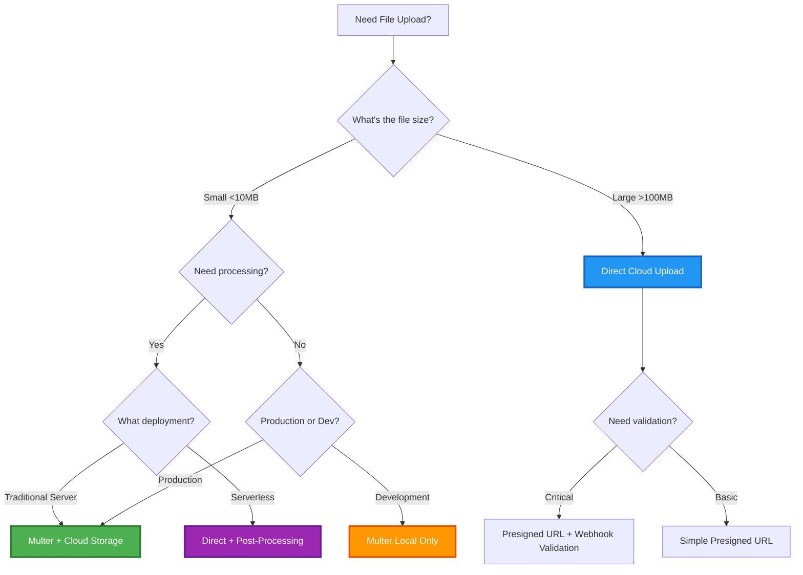

# File Upload Patterns - Quick Reference Guide

> **Quick decision guide for choosing the right file upload pattern in NestJS**

---

## 🎯 Quick Decision Flowchart



---

## 📊 Comparison Matrix

| Feature              | **Multer + Cloud** | **Direct Cloud**        | **Hybrid**     | **Local Only** |
| -------------------- | ------------------ | ----------------------- | -------------- | -------------- |
| **Best For**         | Standard web apps  | Large files, serverless | Smart routing  | Development    |
| **File Size**        | < 50MB             | > 100MB                 | Any            | < 10MB         |
| **Pre-Validation**   | ✅ Yes             | ❌ No                   | ✅ Small files | ✅ Yes         |
| **Processing**       | ✅ Easy            | ⚠️ Complex              | ✅ Small files | ✅ Easy        |
| **Server Load**      | ⚠️ High            | ✅ Low                  | ⚠️ Medium      | ⚠️ High        |
| **Scalability**      | ⚠️ Medium          | ✅ Unlimited            | ✅ High        | ❌ Low         |
| **Cost (Bandwidth)** | ⚠️ Server pays     | ✅ User pays            | ✅ Optimized   | ✅ No cloud    |
| **Security**         | ✅ High            | ⚠️ Medium               | ✅ High        | ✅ High        |
| **Complexity**       | Medium             | Low                     | High           | Low            |
| **Serverless**       | ❌ Limited         | ✅ Perfect              | ⚠️ Partial     | ❌ No          |

---

## 🚀 Implementation Patterns

### Pattern 1: Multer WITH Cloud Storage ⭐ **MOST COMMON**

**Use When:**

- Building standard CRUD applications
- Need validation before cloud storage
- Need image processing (resize, compress)
- Security is critical (virus scanning)
- Files are < 50MB

**Flow:**

```
Client → API (Multer) → Local Temp → Validate → Process → S3 → DB → Cleanup
```

**Key Benefits:**

- ✅ Validate before paying for storage
- ✅ Process images before upload
- ✅ Scan for viruses
- ✅ Easy to implement

**Implementation:** See [Scenario 1](./08-file-handling-media.md#scenario-1-multer-with-cloud-storage)

---

### Pattern 2: Direct Cloud Upload 🚀 **SCALABLE**

**Use When:**

- Files are very large (> 100MB)
- Using serverless (Lambda, Vercel)
- Need maximum scalability
- Building mobile apps
- High traffic applications

**Flow:**

```
Client → API (Get Presigned URL) → Client → S3 (Direct Upload) → API (Confirm) → DB
```

**Key Benefits:**

- ✅ No server bandwidth usage
- ✅ Unlimited scalability
- ✅ Serverless-friendly
- ✅ Progress tracking on client

**Implementation:** See [Scenario 2](./08-file-handling-media-scenarios.md#scenario-2-direct-cloud-upload)

---

### Pattern 3: Hybrid Strategy 🎯 **OPTIMIZED**

**Use When:**

- Need both validation AND scalability
- Mixed file sizes
- Want optimal cost/performance
- Sophisticated application

**Flow:**

```
Client → API → Check Size → Small: Multer Pattern / Large: Direct Pattern
```

**Key Benefits:**

- ✅ Best of both worlds
- ✅ Optimize by file size
- ✅ Cost-effective
- ✅ Flexible

**Implementation:** See [Scenario 3](./08-file-handling-media-scenarios.md#scenario-3-hybrid-upload-strategy)

---

### Pattern 4: Local Only 💻 **DEVELOPMENT**

**Use When:**

- Development environment
- No cloud dependency wanted
- Privacy requirements
- Internal tools only
- Very low traffic

**Flow:**

```
Client → API (Multer) → Local Disk → DB
```

**Key Benefits:**

- ✅ Simple setup
- ✅ No cloud costs
- ✅ Fast iteration
- ✅ Offline development

**Limitations:**

- ❌ Doesn't scale
- ❌ No CDN
- ❌ No redundancy

---

## 🎬 Use Case Examples

### E-Commerce Product Images

**Pattern:** Multer + Cloud Storage  
**Why:** Need to validate, resize (thumbnails), and optimize images before display

### Video Streaming Platform

**Pattern:** Direct Cloud Upload  
**Why:** Large files, need CDN, can validate post-upload

### Social Media App

**Pattern:** Hybrid Strategy  
**Why:** Profile pics (small) vs videos (large), need both validation and scale

### Document Management System

**Pattern:** Multer + Cloud Storage + Virus Scanning  
**Why:** Security critical, need content validation

### Mobile Photo App

**Pattern:** Direct Cloud Upload  
**Why:** Large photos, mobile SDK support, resume capability

### Internal HR Tool

**Pattern:** Local Storage or Multer + Cloud  
**Why:** Low traffic, privacy requirements

---

## 🔒 Security Considerations

### Multer + Cloud Pattern

```typescript
// Validation layers:
1. Multer fileFilter (MIME type)
2. ParseFilePipe (size, type)
3. Custom validation (content-based)
4. Virus scanning
5. Then upload to cloud
```

### Direct Cloud Pattern

```typescript
// Security measures:
1. Presigned URL with expiration (1 hour)
2. Content-Type restriction
3. File size limit in presigned URL
4. Post-upload validation
5. User authentication required
6. Upload confirmation required
```

---

## 📝 Code Templates

### Quick Start: Multer + S3

```bash
# Install dependencies
npm install @nestjs/platform-express multer @aws-sdk/client-s3 sharp

# Configure .env
AWS_REGION=us-east-1
AWS_ACCESS_KEY_ID=your_key
AWS_SECRET_ACCESS_KEY=your_secret
AWS_S3_BUCKET=your-bucket
```

```typescript
// Minimal controller
@Post('upload')
@UseInterceptors(FileInterceptor('file'))
async upload(@UploadedFile() file: Express.Multer.File) {
  // 1. Multer saved to temp
  // 2. Process if needed
  const processed = await this.imageService.resize(file.path);

  // 3. Upload to S3
  const s3Url = await this.s3Service.upload(processed);

  // 4. Cleanup temp
  fs.unlinkSync(file.path);

  // 5. Save to DB
  return this.fileRepo.save({ url: s3Url });
}
```

### Quick Start: Direct Upload

```typescript
// Backend: Generate presigned URL
@Post('request-upload')
async getUploadUrl(@Body() dto: { filename: string; contentType: string }) {
  const key = `uploads/${Date.now()}-${dto.filename}`;
  const url = await this.s3Service.getPresignedUploadUrl(key, dto.contentType);
  return { uploadUrl: url, key };
}

// Frontend: Upload directly
async function uploadFile(file: File) {
  // Get URL
  const { uploadUrl, key } = await api.post('/request-upload', {
    filename: file.name,
    contentType: file.type,
  });

  // Upload to S3
  await axios.put(uploadUrl, file, {
    headers: { 'Content-Type': file.type }
  });

  // Confirm
  await api.post('/confirm-upload', { key });
}
```

---

## 🎓 Learning Path

1. **Start Here:** [Basic File Upload](./08-file-handling-media.md#basic-file-upload)
2. **Then:** [Multer + Cloud Storage](./08-file-handling-media.md#scenario-1-multer-with-cloud-storage)
3. **Advanced:** [Direct Cloud Upload](./08-file-handling-media-scenarios.md#scenario-2-direct-cloud-upload)
4. **Expert:** [Hybrid Strategy](./08-file-handling-media-scenarios.md#scenario-3-hybrid-upload-strategy)

---

## 🔗 Related Resources

- [Main Documentation](./08-file-handling-media.md)
- [Advanced Scenarios](./08-file-handling-media-scenarios.md)
- [AWS S3 Best Practices](https://docs.aws.amazon.com/AmazonS3/latest/userguide/best-practices.html)
- [Sharp Image Processing](https://sharp.pixelplumbing.com/)
- [Multer Documentation](https://github.com/expressjs/multer)

---

## ❓ Common Questions

**Q: Should I use Multer or direct uploads for my app?**  
A: If files < 50MB and you need processing/validation → Multer + Cloud. If files > 100MB or serverfire→ Direct uploads.

**Q: Can I do image processing with direct uploads?**  
A: Yes, but post-upload using queues/webhooks. More complex than Multer pattern.

**Q: Is it safe to let users upload directly to S3?**  
A: Yes, if you use presigned URLs with expiration, validate post-upload, and require authentication.

**Q: What about file size limits?**  
A: Multer pattern: Limited by server RAM/disk. Direct pattern: S3 limit is 5TB per file.

**Q: How do I handle resumable uploads?**  
A: Use S3 multipart upload API or direct upload with chunking libraries.

---

_Created for comprehensive NestJS file upload understanding_ 🚀
