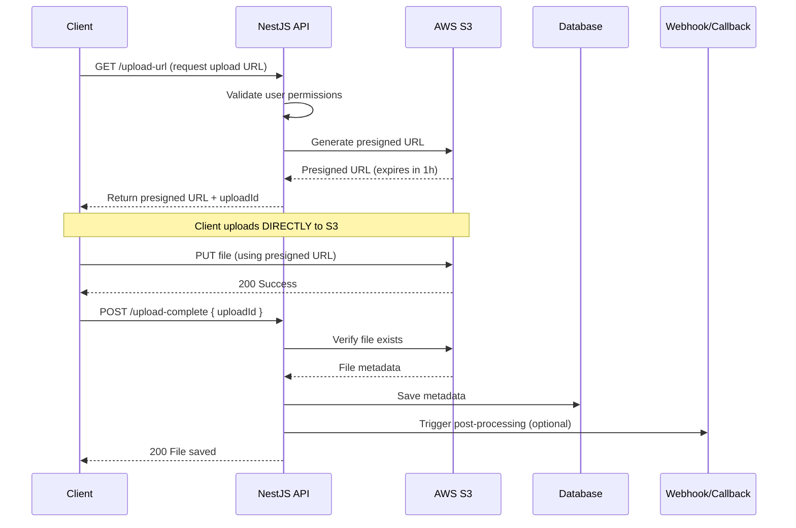
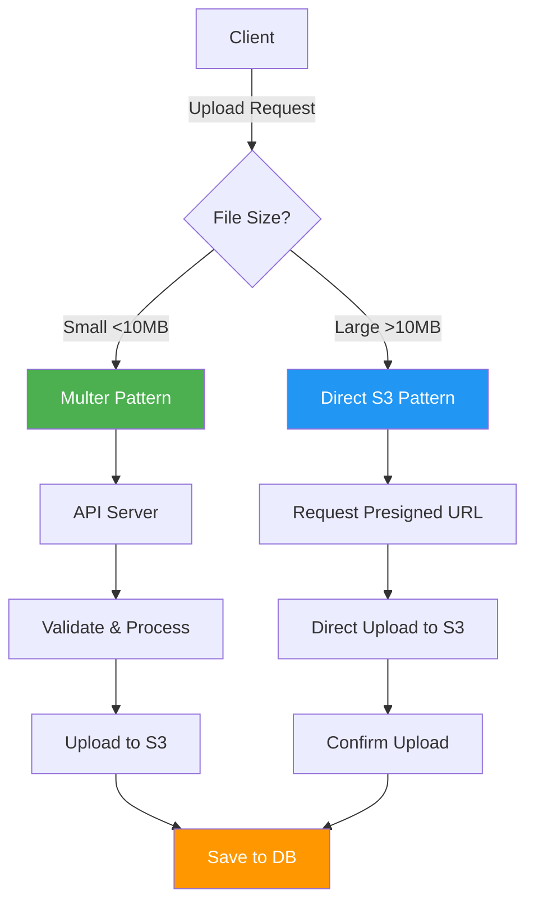
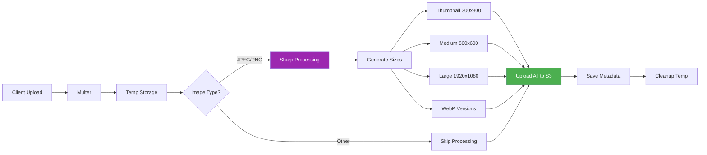

# File Handling & Media - Continued Scenarios

> This document continues from the main [08-file-handling-media.md](./08-file-handling-media.md) document with additional upload patterns and scenarios.

---

## Scenario 2: Direct Cloud Upload (Presigned URLs)

Skip the server entirely - client uploads **directly** to cloud storage using presigned URLs.

### Architecture Flow



### Complete Implementation

#### Step 1: Update S3 Service with Presigned Upload URLs

```typescript
// src/files/services/s3.service.ts
import { Injectable, Logger } from "@nestjs/common";
import { ConfigService } from "@nestjs/config";
import {
  S3Client,
  PutObjectCommand,
  HeadObjectCommand,
  DeleteObjectCommand,
} from "@aws-sdk/client-s3";
import { getSignedUrl } from "@aws-sdk/s3-request-presigner";

@Injectable()
export class S3Service {
  private readonly s3Client: S3Client;
  private readonly bucketName: string;
  private readonly logger = new Logger(S3Service.name);

  constructor(private configService: ConfigService) {
    this.s3Client = new S3Client({
      region: this.configService.get("AWS_REGION"),
      credentials: {
        accessKeyId: this.configService.get("AWS_ACCESS_KEY_ID"),
        secretAccessKey: this.configService.get("AWS_SECRET_ACCESS_KEY"),
      },
    });

    this.bucketName = this.configService.get("AWS_S3_BUCKET");
  }

  /**
   * Generate presigned URL for UPLOAD (PUT operation)
   * This allows clients to upload directly to S3
   *
   * @param key - S3 object key
   * @param contentType - MIME type
   * @param fileSizeLimit - Maximum file size in bytes
   * @param expiresIn - URL expiration time in seconds (default 1 hour)
   * @returns Presigned upload URL
   */
  async generatePresignedUploadUrl(
    key: string,
    contentType: string,
    fileSizeLimit: number = 50 * 1024 * 1024, // 50MB default
    expiresIn: number = 3600
  ): Promise<{
    uploadUrl: string;
    key: string;
    expiresAt: Date;
  }> {
    try {
      const command = new PutObjectCommand({
        Bucket: this.bucketName,
        Key: key,
        ContentType: contentType,
        // Add conditions for security
        // ContentLength: fileSizeLimit, // Maximum file size
      });

      const uploadUrl = await getSignedUrl(this.s3Client, command, {
        expiresIn,
      });

      const expiresAt = new Date(Date.now() + expiresIn * 1000);

      this.logger.log(`Generated presigned upload URL for: ${key}`);

      return {
        uploadUrl,
        key,
        expiresAt,
      };
    } catch (error) {
      this.logger.error(`Failed to generate presigned URL: ${error.message}`);
      throw new Error(`Presigned URL generation failed: ${error.message}`);
    }
  }

  /**
   * Verify that a file exists in S3
   * Used after client uploads to confirm success
   *
   * @param key - S3 object key
   * @returns File metadata
   */
  async verifyFileExists(key: string): Promise<{
    exists: boolean;
    size?: number;
    contentType?: string;
    lastModified?: Date;
  }> {
    try {
      const command = new HeadObjectCommand({
        Bucket: this.bucketName,
        Key: key,
      });

      const response = await this.s3Client.send(command);

      return {
        exists: true,
        size: response.ContentLength,
        contentType: response.ContentType,
        lastModified: response.LastModified,
      };
    } catch (error) {
      if (error.name === "NotFound") {
        return { exists: false };
      }
      throw error;
    }
  }

  /**
   * Get file URL (for public or presigned access)
   */
  getFileUrl(key: string): string {
    return `https://${this.bucketName}.s3.amazonaws.com/${key}`;
  }
}
```

#### Step 2: Create Upload DTOs

```typescript
// src/files/dto/request-upload-url.dto.ts
import {
  IsString,
  IsEnum,
  IsNumber,
  Min,
  Max,
  IsOptional,
} from "class-validator";

export enum AllowedFileTypes {
  IMAGE_JPEG = "image/jpeg",
  IMAGE_PNG = "image/png",
  IMAGE_GIF = "image/gif",
  IMAGE_WEBP = "image/webp",
  PDF = "application/pdf",
  DOC = "application/msword",
  DOCX = "application/vnd.openxmlformats-officedocument.wordprocessingml.document",
}

export class RequestUploadUrlDto {
  @IsString()
  filename: string;

  @IsEnum(AllowedFileTypes, {
    message: "File type not allowed",
  })
  contentType: AllowedFileTypes;

  @IsNumber()
  @Min(1)
  @Max(100 * 1024 * 1024) // 100MB max
  fileSize: number;

  @IsOptional()
  @IsString()
  folder?: string; // Optional folder/category
}

// src/files/dto/confirm-upload.dto.ts
export class ConfirmUploadDto {
  @IsString()
  uploadId: string;

  @IsString()
  key: string;
}
```

#### Step 3: Create Upload Entity

```typescript
// src/files/entities/pending-upload.entity.ts
import {
  Entity,
  PrimaryGeneratedColumn,
  Column,
  CreateDateColumn,
  UpdateDateColumn,
} from "typeorm";

export enum UploadStatus {
  PENDING = "pending",
  COMPLETED = "completed",
  FAILED = "failed",
  EXPIRED = "expired",
}

@Entity("pending_uploads")
export class PendingUpload {
  @PrimaryGeneratedColumn("uuid")
  id: string;

  @Column()
  userId: string; // Track who initiated the upload

  @Column()
  key: string; // S3 object key

  @Column()
  filename: string;

  @Column()
  contentType: string;

  @Column({ type: "bigint" })
  expectedSize: number;

  @Column({
    type: "enum",
    enum: UploadStatus,
    default: UploadStatus.PENDING,
  })
  status: UploadStatus;

  @Column({ type: "timestamp" })
  expiresAt: Date;

  @CreateDateColumn()
  createdAt: Date;

  @UpdateDateColumn()
  updatedAt: Date;
}
```

#### Step 4: Update Files Service

```typescript
// src/files/files.service.ts
import {
  Injectable,
  NotFoundException,
  BadRequestException,
  Logger,
} from "@nestjs/common";
import { InjectRepository } from "@nestjs/typeorm";
import { Repository, LessThan } from "typeorm";
import { File, FileStorageType } from "./entities/file.entity";
import { PendingUpload, UploadStatus } from "./entities/pending-upload.entity";
import { S3Service } from "./services/s3.service";
import { RequestUploadUrlDto } from "./dto/request-upload-url.dto";
import { ConfirmUploadDto } from "./dto/confirm-upload.dto";

@Injectable()
export class FilesService {
  private readonly logger = new Logger(FilesService.name);

  constructor(
    @InjectRepository(File)
    private filesRepository: Repository<File>,
    @InjectRepository(PendingUpload)
    private pendingUploadsRepository: Repository<PendingUpload>,
    private s3Service: S3Service
  ) {}

  /**
   * Request a presigned upload URL
   * Pattern: Direct Client → S3 upload
   *
   * @param userId - ID of user requesting upload
   * @param dto - Upload request details
   * @returns Presigned URL and upload ID
   */
  async requestUploadUrl(
    userId: string,
    dto: RequestUploadUrlDto
  ): Promise<{
    uploadId: string;
    uploadUrl: string;
    key: string;
    expiresAt: Date;
  }> {
    // Generate unique S3 key
    const folder = dto.folder || "uploads";
    const timestamp = Date.now();
    const randomSuffix = Math.round(Math.random() * 1e9);
    const key = `${folder}/${timestamp}-${randomSuffix}-${dto.filename}`;

    // Generate presigned URL
    const { uploadUrl, expiresAt } =
      await this.s3Service.generatePresignedUploadUrl(
        key,
        dto.contentType,
        dto.fileSize
      );

    // Create pending upload record
    const pendingUpload = this.pendingUploadsRepository.create({
      userId,
      key,
      filename: dto.filename,
      contentType: dto.contentType,
      expectedSize: dto.fileSize,
      expiresAt,
      status: UploadStatus.PENDING,
    });

    const saved = await this.pendingUploadsRepository.save(pendingUpload);

    this.logger.log(`Upload URL generated for user ${userId}: ${saved.id}`);

    return {
      uploadId: saved.id,
      uploadUrl,
      key,
      expiresAt,
    };
  }

  /**
   * Confirm upload completion
   * Called by client after successful S3 upload
   *
   * @param dto - Confirmation details
   * @returns Saved file record
   */
  async confirmUpload(dto: ConfirmUploadDto, userId: string): Promise<File> {
    // Find pending upload
    const pendingUpload = await this.pendingUploadsRepository.findOne({
      where: {
        id: dto.uploadId,
        key: dto.key,
        userId,
      },
    });

    if (!pendingUpload) {
      throw new NotFoundException("Upload request not found");
    }

    // Check if expired
    if (new Date() > pendingUpload.expiresAt) {
      pendingUpload.status = UploadStatus.EXPIRED;
      await this.pendingUploadsRepository.save(pendingUpload);
      throw new BadRequestException("Upload request expired");
    }

    // Check if already completed
    if (pendingUpload.status === UploadStatus.COMPLETED) {
      throw new BadRequestException("Upload already confirmed");
    }

    // Verify file exists in S3
    const verification = await this.s3Service.verifyFileExists(dto.key);

    if (!verification.exists) {
      pendingUpload.status = UploadStatus.FAILED;
      await this.pendingUploadsRepository.save(pendingUpload);
      throw new BadRequestException("File not found in storage");
    }

    // Create file record
    const file = this.filesRepository.create({
      originalName: pendingUpload.filename,
      filename: pendingUpload.filename,
      path: this.s3Service.getFileUrl(dto.key),
      s3Key: dto.key,
      size: verification.size,
      mimetype: pendingUpload.contentType,
      storage: FileStorageType.S3,
    });

    const savedFile = await this.filesRepository.save(file);

    // Update pending upload status
    pendingUpload.status = UploadStatus.COMPLETED;
    await this.pendingUploadsRepository.save(pendingUpload);

    this.logger.log(`Upload confirmed: ${savedFile.id}`);

    // TODO: Trigger post-processing if needed (e.g., thumbnail generation)
    // this.queueService.add('process-image', { fileId: savedFile.id });

    return savedFile;
  }

  /**
   * Cleanup expired pending uploads
   * Run this periodically (e.g., cron job)
   */
  async cleanupExpiredUploads(): Promise<void> {
    const expired = await this.pendingUploadsRepository.find({
      where: {
        status: UploadStatus.PENDING,
        expiresAt: LessThan(new Date()),
      },
    });

    for (const upload of expired) {
      // Try to delete from S3 if it exists
      try {
        await this.s3Service.deleteFile(upload.key);
      } catch (error) {
        this.logger.warn(`Cleanup warning for ${upload.key}: ${error.message}`);
      }

      upload.status = UploadStatus.EXPIRED;
      await this.pendingUploadsRepository.save(upload);
    }

    this.logger.log(`Cleaned up ${expired.length} expired uploads`);
  }
}
```

#### Step 5: Update Controller

```typescript
// src/files/files.controller.ts
import {
  Controller,
  Post,
  Body,
  UseGuards,
  Request,
  Get,
} from "@nestjs/common";
import { FilesService } from "./files.service";
import { RequestUploadUrlDto } from "./dto/request-upload-url.dto";
import { ConfirmUploadDto } from "./dto/confirm-upload.dto";
import { JwtAuthGuard } from "../auth/guards/jwt-auth.guard"; // Your auth guard

@Controller("files")
export class FilesController {
  constructor(private readonly filesService: FilesService) {}

  /**
   * Step 1: Request upload URL
   * Client calls this before uploading
   *
   * @returns Presigned URL and upload ID
   */
  @Post("request-upload")
  @UseGuards(JwtAuthGuard) // Ensure user is authenticated
  async requestUploadUrl(@Request() req, @Body() dto: RequestUploadUrlDto) {
    const userId = req.user.id; // From JWT token

    const result = await this.filesService.requestUploadUrl(userId, dto);

    return {
      message: "Upload URL generated",
      ...result,
      instructions: {
        step1: `Use PUT request to upload file to the uploadUrl`,
        step2: `After successful upload, call POST /files/confirm-upload with uploadId and key`,
        headers: {
          "Content-Type": dto.contentType,
        },
      },
    };
  }

  /**
   * Step 2: Confirm upload
   * Client calls this after successful S3 upload
   *
   * @returns File record
   */
  @Post("confirm-upload")
  @UseGuards(JwtAuthGuard)
  async confirmUpload(@Request() req, @Body() dto: ConfirmUploadDto) {
    const userId = req.user.id;

    const file = await this.filesService.confirmUpload(dto, userId);

    return {
      message: "Upload confirmed successfully",
      file: {
        id: file.id,
        url: file.path,
        size: file.size,
        mimetype: file.mimetype,
      },
    };
  }

  /**
   * Cleanup endpoint (can be called by cron or admin)
   */
  @Post("cleanup-expired")
  @UseGuards(JwtAuthGuard) // Add admin guard if needed
  async cleanupExpired() {
    await this.filesService.cleanupExpiredUploads();
    return { message: "Cleanup completed" };
  }
}
```

#### Step 6: Frontend Implementation

```typescript
// Frontend code example (React/Next.js)
import axios from "axios";

interface UploadResult {
  fileId: string;
  url: string;
}

/**
 * Upload file directly to S3 using presigned URL
 */
async function uploadFileDirectly(file: File): Promise<UploadResult> {
  try {
    // Step 1: Request upload URL from your API
    const { data: uploadData } = await axios.post(
      "/api/files/request-upload",
      {
        filename: file.name,
        contentType: file.type,
        fileSize: file.size,
      },
      {
        headers: {
          Authorization: `Bearer ${getAuthToken()}`,
        },
      }
    );

    const { uploadUrl, uploadId, key } = uploadData;

    // Step 2: Upload file DIRECTLY to S3 using presigned URL
    await axios.put(uploadUrl, file, {
      headers: {
        "Content-Type": file.type,
      },
      // Show upload progress
      onUploadProgress: (progressEvent) => {
        const percentCompleted = Math.round(
          (progressEvent.loaded * 100) / progressEvent.total
        );
        console.log(`Upload progress: ${percentCompleted}%`);
      },
    });

    // Step 3: Confirm upload with your API
    const { data: confirmData } = await axios.post(
      "/api/files/confirm-upload",
      {
        uploadId,
        key,
      },
      {
        headers: {
          Authorization: `Bearer ${getAuthToken()}`,
        },
      }
    );

    return {
      fileId: confirmData.file.id,
      url: confirmData.file.url,
    };
  } catch (error) {
    console.error("Upload failed:", error);
    throw error;
  }
}

// Usage in component
function FileUploader() {
  const handleFileUpload = async (
    event: React.ChangeEvent<HTMLInputElement>
  ) => {
    const file = event.target.files?.[0];
    if (!file) return;

    try {
      const result = await uploadFileDirectly(file);
      console.log("File uploaded:", result);
      alert(`File uploaded successfully! ID: ${result.fileId}`);
    } catch (error) {
      alert("Upload failed. Please try again.");
    }
  };

  return (
    <div>
      <input type="file" onChange={handleFileUpload} />
    </div>
  );
}
```

### Why This Pattern?

**Advantages:**
✅ **No server bandwidth**: File doesn't go through your API  
✅ **Scalable**: Unlimited concurrent uploads  
✅ **Fast**: Direct to S3 = lower latency  
✅ **Serverless-friendly**: No file system needed  
✅ **Cost-effective**: Reduced server load  
✅ **Progress tracking**: Easy on client side

**Disadvantages:**
⚠️ **No pre-upload validation**: Can't check content before upload  
⚠️ **Security risk**: Users can upload anything (mitigate with ACLs)  
⚠️ **Post-processing complex**: Need separate worker for processing  
⚠️ **Cost risk**: Pay for invalid uploads

**Best for:**

- Large file uploads (>100MB)
- Video uploads
- Mobile applications
- Serverless architectures
- High-traffic applications
- SaaS platforms with many concurrent users

---

## Scenario 3: Hybrid Upload Strategy

Smart routing based on file size - small files through Multer, large files direct to S3.

### Architecture Overview



### Implementation

```typescript
// src/files/files.service.ts

const SMALL_FILE_THRESHOLD = 10 * 1024 * 1024; // 10MB

@Injectable()
export class FilesService {
  // ... previous code

  /**
   * Determine upload strategy based on file size
   */
  determineUploadStrategy(fileSize: number): "multer" | "direct" {
    return fileSize > SMALL_FILE_THRESHOLD ? "direct" : "multer";
  }
}

// src/files/files.controller.ts

@Controller("files")
export class FilesController {
  /**
   * Smart upload endpoint - routes based on file size
   */
  @Post("upload-smart")
  @UseGuards(JwtAuthGuard)
  async smartUpload(
    @Request() req,
    @Body() body: { fileSize: number; filename: string; contentType: string }
  ) {
    const strategy = this.filesService.determineUploadStrategy(body.fileSize);

    if (strategy === "direct") {
      // Large file - return presigned URL
      return await this.filesService.requestUploadUrl(req.user.id, {
        filename: body.filename,
        contentType: body.contentType as AllowedFileTypes,
        fileSize: body.fileSize,
      });
    } else {
      // Small file - use regular Multer upload
      return {
        strategy: "multer",
        uploadEndpoint: "/files/upload",
        message: "Use multipart/form-data upload to /files/upload",
      };
    }
  }
}
```

---

## Scenario 4: Image Processing Pipeline

Complete image processing workflow with multiple output formats.

### Architecture



### Complete Implementation

```typescript
// src/files/services/advanced-image-processing.service.ts
import { Injectable, Logger } from "@nestjs/common";
import * as sharp from "sharp";
import * as path from "path";

export interface ProcessedImageSet {
  original: {
    path: string;
    width: number;
    height: number;
    format: string;
    size: number;
  };
  sizes: {
    thumbnail: ProcessedImage;
    small: ProcessedImage;
    medium: ProcessedImage;
    large: ProcessedImage;
  };
  webp: {
    thumbnail: ProcessedImage;
    small: ProcessedImage;
    medium: ProcessedImage;
    large: ProcessedImage;
  };
}

interface ProcessedImage {
  path: string;
  width: number;
  height: number;
  size: number;
}

@Injectable()
export class AdvancedImageProcessingService {
  private readonly logger = new Logger(AdvancedImageProcessingService.name);

  /**
   * Process image into multiple sizes and formats
   * Creates JPEG and WebP versions for optimal web delivery
   */
  async processImageComplete(
    inputPath: string,
    outputDir: string,
    baseFilename: string
  ): Promise<ProcessedImageSet> {
    try {
      // Get original image metadata
      const metadata = await sharp(inputPath).metadata();

      const result: ProcessedImageSet = {
        original: {
          path: inputPath,
          width: metadata.width,
          height: metadata.height,
          format: metadata.format,
          size: metadata.size,
        },
        sizes: {} as any,
        webp: {} as any,
      };

      // Define size configurations
      const sizes = [
        { name: "thumbnail", width: 300, height: 300, fit: "cover" as const },
        { name: "small", width: 480, height: 480, fit: "inside" as const },
        { name: "medium", width: 800, height: 600, fit: "inside" as const },
        { name: "large", width: 1920, height: 1080, fit: "inside" as const },
      ];

      // Process all sizes in parallel
      await Promise.all(
        sizes.flatMap((sizeConfig) => [
          // JPEG version
          this.processSingleSize(
            inputPath,
            outputDir,
            baseFilename,
            sizeConfig,
            "jpeg"
          ).then((processed) => {
            result.sizes[sizeConfig.name] = processed;
          }),
          // WebP version
          this.processSingleSize(
            inputPath,
            outputDir,
            baseFilename,
            sizeConfig,
            "webp"
          ).then((processed) => {
            result.webp[sizeConfig.name] = processed;
          }),
        ])
      );

      this.logger.log(`Image processing complete: ${baseFilename}`);
      return result;
    } catch (error) {
      this.logger.error(`Image processing failed: ${error.message}`);
      throw new Error(`Image processing failed: ${error.message}`);
    }
  }

  /**
   * Process a single size/format combination
   */
  private async processSingleSize(
    inputPath: string,
    outputDir: string,
    baseFilename: string,
    sizeConfig: { name: string; width: number; height: number; fit: string },
    format: "jpeg" | "webp"
  ): Promise<ProcessedImage> {
    const ext = format === "webp" ? "webp" : "jpg";
    const outputPath = path.join(
      outputDir,
      `${baseFilename}-${sizeConfig.name}.${ext}`
    );

    const processor = sharp(inputPath).resize(
      sizeConfig.width,
      sizeConfig.height,
      {
        fit: sizeConfig.fit as any,
        withoutEnlargement: true,
      }
    );

    // Apply format-specific options
    if (format === "webp") {
      processor.webp({ quality: 85 });
    } else {
      processor.jpeg({ quality: 85, progressive: true });
    }

    await processor.toFile(outputPath);

    // Get output metadata
    const metadata = await sharp(outputPath).metadata();

    return {
      path: outputPath,
      width: metadata.width,
      height: metadata.height,
      size: metadata.size,
    };
  }

  /**
   * Add watermark to image
   */
  async addWatermark(
    inputPath: string,
    outputPath: string,
    watermarkPath: string
  ): Promise<void> {
    await sharp(inputPath)
      .composite([
        {
          input: watermarkPath,
          gravity: "southeast", // Position: bottom-right
        },
      ])
      .toFile(outputPath);
  }

  /**
   * Convert HEIC to JPEG (for iOS photos)
   */
  async convertHeicToJpeg(
    inputPath: string,
    outputPath: string
  ): Promise<void> {
    await sharp(inputPath).jpeg({ quality: 90 }).toFile(outputPath);
  }
}
```

---

_This document continues with more scenarios. Refer to the main documentation for additional patterns._
