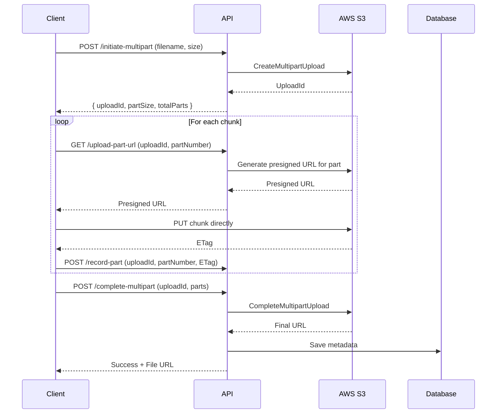
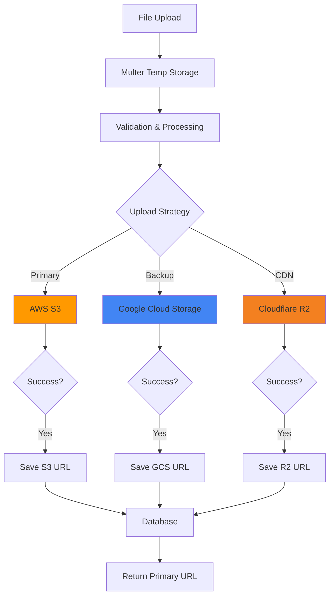
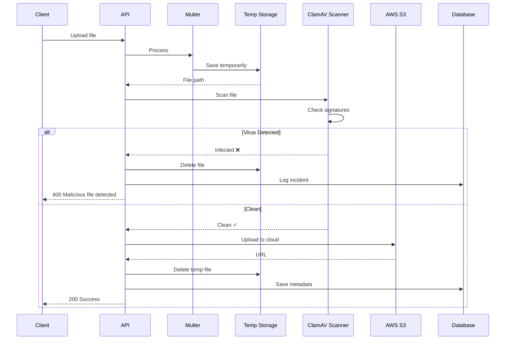

# Additional File Upload Scenarios - Complete Guide

> **Part 3: Advanced patterns for specialized use cases**

---

## Table of Contents

1. [Scenario 5: Large File Upload with Chunking](#scenario-5-large-file-upload-with-chunking)
2. [Scenario 6: Multi-Cloud Strategy](#scenario-6-multi-cloud-strategy)
3. [Scenario 7: Virus Scanning Pipeline](#scenario-7-virus-scanning-pipeline)
4. [Scenario 8: Serverless File Processing](#scenario-8-serverless-file-processing)
5. [Scenario 9: CDN Integration](#scenario-9-cdn-integration)
6. [Scenario 10: Real-time Progress Tracking](#scenario-10-real-time-progress-tracking)

---

## Scenario 5: Large File Upload with Chunking

Handle very large files (>1GB) with resumable uploads using S3 multipart upload.

### Architecture



### Complete Implementation

```typescript
// src/files/dto/multipart-upload.dto.ts
import { IsString, IsNumber, IsArray, ValidateNested } from "class-validator";
import { Type } from "class-transformer";

export class InitiateMultipartDto {
  @IsString()
  filename: string;

  @IsString()
  contentType: string;

  @IsNumber()
  fileSize: number;
}

export class UploadPartDto {
  @IsString()
  uploadId: string;

  @IsNumber()
  partNumber: number;
}

export class RecordPartDto {
  @IsString()
  uploadId: string;

  @IsNumber()
  partNumber: number;

  @IsString()
  eTag: string;
}

class PartInfo {
  @IsNumber()
  partNumber: number;

  @IsString()
  eTag: string;
}

export class CompleteMultipartDto {
  @IsString()
  uploadId: string;

  @IsArray()
  @ValidateNested({ each: true })
  @Type(() => PartInfo)
  parts: PartInfo[];
}

// src/files/services/multipart-upload.service.ts
import { Injectable, Logger } from "@nestjs/common";
import { ConfigService } from "@nestjs/config";
import {
  S3Client,
  CreateMultipartUploadCommand,
  UploadPartCommand,
  CompleteMultipartUploadCommand,
  AbortMultipartUploadCommand,
} from "@aws-sdk/client-s3";
import { getSignedUrl } from "@aws-sdk/s3-request-presigner";

interface MultipartUpload {
  uploadId: string;
  key: string;
  bucket: string;
}

@Injectable()
export class MultipartUploadService {
  private readonly s3Client: S3Client;
  private readonly bucketName: string;
  private readonly logger = new Logger(MultipartUploadService.name);

  // Store active uploads (use Redis in production)
  private activeUploads = new Map<string, MultipartUpload>();

  constructor(private configService: ConfigService) {
    this.s3Client = new S3Client({
      region: this.configService.get("AWS_REGION"),
      credentials: {
        accessKeyId: this.configService.get("AWS_ACCESS_KEY_ID"),
        secretAccessKey: this.configService.get("AWS_SECRET_ACCESS_KEY"),
      },
    });

    this.bucketName = this.configService.get("AWS_S3_BUCKET");
  }

  /**
   * Calculate optimal part size and total parts
   * S3 requirements:
   * - Part size: 5MB to 5GB
   * - Max parts: 10,000
   * - Max file size: 5TB
   */
  calculatePartSize(fileSize: number): {
    partSize: number;
    totalParts: number;
  } {
    const MIN_PART_SIZE = 5 * 1024 * 1024; // 5MB
    const MAX_PARTS = 10000;

    let partSize = MIN_PART_SIZE;
    let totalParts = Math.ceil(fileSize / partSize);

    // If we exceed max parts, increase part size
    while (totalParts > MAX_PARTS) {
      partSize = partSize * 2;
      totalParts = Math.ceil(fileSize / partSize);
    }

    return { partSize, totalParts };
  }

  /**
   * Step 1: Initiate multipart upload
   */
  async initiateMultipartUpload(
    filename: string,
    contentType: string,
    fileSize: number
  ): Promise<{
    uploadId: string;
    key: string;
    partSize: number;
    totalParts: number;
  }> {
    const key = `uploads/large/${Date.now()}-${filename}`;

    const command = new CreateMultipartUploadCommand({
      Bucket: this.bucketName,
      Key: key,
      ContentType: contentType,
    });

    const response = await this.s3Client.send(command);
    const uploadId = response.UploadId;

    // Store upload info
    this.activeUploads.set(uploadId, {
      uploadId,
      key,
      bucket: this.bucketName,
    });

    const { partSize, totalParts } = this.calculatePartSize(fileSize);

    this.logger.log(`Multipart upload initiated: ${uploadId}`);

    return {
      uploadId,
      key,
      partSize,
      totalParts,
    };
  }

  /**
   * Step 2: Generate presigned URL for uploading a specific part
   */
  async getPartUploadUrl(
    uploadId: string,
    partNumber: number
  ): Promise<string> {
    const upload = this.activeUploads.get(uploadId);

    if (!upload) {
      throw new Error("Upload not found or expired");
    }

    const command = new UploadPartCommand({
      Bucket: upload.bucket,
      Key: upload.key,
      UploadId: uploadId,
      PartNumber: partNumber,
    });

    const url = await getSignedUrl(this.s3Client, command, {
      expiresIn: 3600, // 1 hour
    });

    return url;
  }

  /**
   * Step 3: Complete multipart upload
   */
  async completeMultipartUpload(
    uploadId: string,
    parts: Array<{ partNumber: number; eTag: string }>
  ): Promise<string> {
    const upload = this.activeUploads.get(uploadId);

    if (!upload) {
      throw new Error("Upload not found or expired");
    }

    // Sort parts by part number
    const sortedParts = parts.sort((a, b) => a.partNumber - b.partNumber);

    const command = new CompleteMultipartUploadCommand({
      Bucket: upload.bucket,
      Key: upload.key,
      UploadId: uploadId,
      MultipartUpload: {
        Parts: sortedParts.map((part) => ({
          PartNumber: part.partNumber,
          ETag: part.eTag,
        })),
      },
    });

    const response = await this.s3Client.send(command);

    // Cleanup
    this.activeUploads.delete(uploadId);

    this.logger.log(`Multipart upload completed: ${uploadId}`);

    return response.Location;
  }

  /**
   * Abort multipart upload (cleanup on error)
   */
  async abortMultipartUpload(uploadId: string): Promise<void> {
    const upload = this.activeUploads.get(uploadId);

    if (!upload) {
      return; // Already cleaned up
    }

    const command = new AbortMultipartUploadCommand({
      Bucket: upload.bucket,
      Key: upload.key,
      UploadId: uploadId,
    });

    await this.s3Client.send(command);
    this.activeUploads.delete(uploadId);

    this.logger.log(`Multipart upload aborted: ${uploadId}`);
  }
}

// src/files/files.controller.ts (add these endpoints)

@Controller("files")
export class FilesController {
  constructor(
    private readonly multipartService: MultipartUploadService,
    private readonly filesService: FilesService
  ) {}

  /**
   * 1. Initiate multipart upload
   */
  @Post("multipart/initiate")
  @UseGuards(JwtAuthGuard)
  async initiateMultipart(@Body() dto: InitiateMultipartDto) {
    const result = await this.multipartService.initiateMultipartUpload(
      dto.filename,
      dto.contentType,
      dto.fileSize
    );

    return {
      ...result,
      instructions: {
        step1: "Request presigned URL for each part",
        step2: "Upload each part directly to S3 using PUT",
        step3: "Record ETag from each upload",
        step4: "Call complete endpoint with all ETags",
      },
    };
  }

  /**
   * 2. Get presigned URL for specific part
   */
  @Post("multipart/part-url")
  @UseGuards(JwtAuthGuard)
  async getPartUrl(@Body() dto: UploadPartDto) {
    const url = await this.multipartService.getPartUploadUrl(
      dto.uploadId,
      dto.partNumber
    );

    return {
      uploadUrl: url,
      partNumber: dto.partNumber,
    };
  }

  /**
   * 3. Record uploaded part (optional, for tracking)
   */
  @Post("multipart/record-part")
  @UseGuards(JwtAuthGuard)
  async recordPart(@Body() dto: RecordPartDto) {
    // In production, store this in database/Redis for tracking
    return { message: "Part recorded", ...dto };
  }

  /**
   * 4. Complete multipart upload
   */
  @Post("multipart/complete")
  @UseGuards(JwtAuthGuard)
  async completeMultipart(@Request() req, @Body() dto: CompleteMultipartDto) {
    const fileUrl = await this.multipartService.completeMultipartUpload(
      dto.uploadId,
      dto.parts
    );

    // Save to database
    // const file = await this.filesService.create({ ... });

    return {
      message: "Upload completed successfully",
      url: fileUrl,
    };
  }

  /**
   * Abort multipart upload
   */
  @Post("multipart/abort")
  @UseGuards(JwtAuthGuard)
  async abortMultipart(@Body() body: { uploadId: string }) {
    await this.multipartService.abortMultipartUpload(body.uploadId);
    return { message: "Upload aborted" };
  }
}
```

### Frontend Implementation (React)

```typescript
// multipart-uploader.ts
import axios from "axios";

interface UploadProgress {
  loaded: number;
  total: number;
  percentage: number;
}

export class MultipartUploader {
  private file: File;
  private onProgress: (progress: UploadProgress) => void;
  private uploadId: string;
  private parts: Array<{ partNumber: number; eTag: string }> = [];

  constructor(file: File, onProgress?: (progress: UploadProgress) => void) {
    this.file = file;
    this.onProgress = onProgress || (() => {});
  }

  async upload(): Promise<string> {
    try {
      // Step 1: Initiate
      const initResponse = await this.initiateUpload();
      this.uploadId = initResponse.uploadId;
      const { partSize, totalParts } = initResponse;

      // Step 2: Upload parts in parallel (limit concurrency)
      await this.uploadParts(partSize, totalParts);

      // Step 3: Complete
      const fileUrl = await this.completeUpload();

      return fileUrl;
    } catch (error) {
      // Abort on error
      await this.abortUpload();
      throw error;
    }
  }

  private async initiateUpload() {
    const { data } = await axios.post("/api/files/multipart/initiate", {
      filename: this.file.name,
      contentType: this.file.type,
      fileSize: this.file.size,
    });

    return data;
  }

  private async uploadParts(partSize: number, totalParts: number) {
    const chunkPromises: Promise<void>[] = [];
    let uploadedBytes = 0;

    for (let partNumber = 1; partNumber <= totalParts; partNumber++) {
      const start = (partNumber - 1) * partSize;
      const end = Math.min(start + partSize, this.file.size);
      const chunk = this.file.slice(start, end);

      // Upload with concurrency control (5 at a time)
      if (chunkPromises.length >= 5) {
        await Promise.race(chunkPromises);
      }

      const promise = this.uploadPart(partNumber, chunk).then(() => {
        uploadedBytes += chunk.size;
        this.onProgress({
          loaded: uploadedBytes,
          total: this.file.size,
          percentage: (uploadedBytes / this.file.size) * 100,
        });
      });

      chunkPromises.push(promise);
    }

    await Promise.all(chunkPromises);
  }

  private async uploadPart(partNumber: number, chunk: Blob): Promise<void> {
    // Get presigned URL for this part
    const { data } = await axios.post("/api/files/multipart/part-url", {
      uploadId: this.uploadId,
      partNumber,
    });

    // Upload chunk directly to S3
    const response = await axios.put(data.uploadUrl, chunk, {
      headers: {
        "Content-Type": this.file.type,
      },
    });

    // Extract ETag from response
    const eTag = response.headers.etag;

    // Record part
    this.parts.push({ partNumber, eTag });

    await axios.post("/api/files/multipart/record-part", {
      uploadId: this.uploadId,
      partNumber,
      eTag,
    });
  }

  private async completeUpload(): Promise<string> {
    const { data } = await axios.post("/api/files/multipart/complete", {
      uploadId: this.uploadId,
      parts: this.parts,
    });

    return data.url;
  }

  private async abortUpload(): Promise<void> {
    if (this.uploadId) {
      await axios.post("/api/files/multipart/abort", {
        uploadId: this.uploadId,
      });
    }
  }
}

// Usage in component
function LargeFileUploader() {
  const [progress, setProgress] = useState(0);
  const [uploading, setUploading] = useState(false);

  const handleUpload = async (event: React.ChangeEvent<HTMLInputElement>) => {
    const file = event.target.files?.[0];
    if (!file) return;

    setUploading(true);

    try {
      const uploader = new MultipartUploader(file, (progress) => {
        setProgress(progress.percentage);
      });

      const url = await uploader.upload();
      alert(`Upload complete! URL: ${url}`);
    } catch (error) {
      alert("Upload failed");
    } finally {
      setUploading(false);
    }
  };

  return (
    <div>
      <input type="file" onChange={handleUpload} disabled={uploading} />
      {uploading && <div>Uploading: {progress.toFixed(2)}%</div>}
    </div>
  );
}
```

---

## Scenario 6: Multi-Cloud Strategy

Upload to multiple cloud providers for redundancy and cost optimization.

### Architecture



### Implementation

```typescript
// src/files/services/cloud-storage.service.ts
import { Injectable, Logger } from "@nestjs/common";

export enum StorageProvider {
  S3 = "s3",
  GCS = "gcs",
  CLOUDFLARE_R2 = "r2",
  AZURE_BLOB = "azure",
}

export interface UploadResult {
  provider: StorageProvider;
  url: string;
  key: string;
  success: boolean;
  error?: string;
}

@Injectable()
export class CloudStorageService {
  private readonly logger = new Logger(CloudStorageService.name);

  constructor(
    private s3Service: S3Service
  ) // private gcsService: GCSService, // Implement similarly
  // private r2Service: R2Service,
  {}

  /**
   * Upload to multiple providers  in parallel
   */
  async uploadToMultipleProviders(
    filePath: string,
    filename: string,
    contentType: string,
    providers: StorageProvider[] = [StorageProvider.S3]
  ): Promise<UploadResult[]> {
    const uploads = providers.map(async (provider) => {
      try {
        const result = await this.uploadToProvider(
          provider,
          filePath,
          filename,
          contentType
        );

        return {
          provider,
          ...result,
          success: true,
        };
      } catch (error) {
        this.logger.error(`Upload to ${provider} failed: ${error.message}`);
        return {
          provider,
          url: "",
          key: "",
          success: false,
          error: error.message,
        };
      }
    });

    return await Promise.all(uploads);
  }

  private async uploadToProvider(
    provider: StorageProvider,
    filePath: string,
    filename: string,
    contentType: string
  ): Promise<{ url: string; key: string }> {
    const key = `uploads/${Date.now()}-${filename}`;

    switch (provider) {
      case StorageProvider.S3:
        const url = await this.s3Service.uploadFile(filePath, key, contentType);
        return { url, key };

      // case StorageProvider.GCS:
      //   return await this.gcsService.upload(filePath, key, contentType);

      // Add other providers...

      default:
        throw new Error(`Provider ${provider} not implemented`);
    }
  }
}
```

---

## Scenario 7: Virus Scanning Pipeline

Scan uploaded files for malware before storing in cloud.

### Architecture



### Implementation

```bash
# Install ClamAV (Ubuntu/Debian)
sudo apt-get install clamav clamav-daemon
sudo freshclam  # Update virus definitions
sudo service clamav-daemon start
```

```typescript
// Install Node.js ClamAV client
// npm install clamscan

// src/files/services/virus-scanner.service.ts
import { Injectable, Logger } from "@nestjs/common";
import NodeClam from "clamscan";

export interface ScanResult {
  isInfected: boolean;
  viruses: string[];
  file: string;
}

@Injectable()
export class VirusScannerService {
  private readonly logger = new Logger(VirusScannerService.name);
  private clamscan: NodeClam;

  async onModuleInit() {
    this.clamscan = await new NodeClam().init({
      clamdscan: {
        host: "localhost",
        port: 3310,
      },
      preference: "clamdscan", // Use daemon for better performance
    });

    this.logger.log("Virus scanner initialized");
  }

  /**
   * Scan file for viruses
   */
  async scanFile(filePath: string): Promise<ScanResult> {
    try {
      const { isInfected, viruses, file } = await this.clamscan.scanFile(
        filePath
      );

      this.logger.log(
        `Scan result for ${file}: ${isInfected ? "INFECTED" : "CLEAN"}`
      );

      return {
        isInfected,
        viruses: viruses || [],
        file,
      };
    } catch (error) {
      this.logger.error(`Virus scan failed: ${error.message}`);
      throw new Error(`Virus scan failed: ${error.message}`);
    }
  }

  /**
   * Scan buffer (for memory storage)
   */
  async scanBuffer(buffer: Buffer): Promise<ScanResult> {
    const { isInfected, viruses } = await this.clamscan.scanStream(buffer);

    return {
      isInfected,
      viruses: viruses || [],
      file: "buffer",
    };
  }
}

// Update files.service.ts
@Injectable()
export class FilesService {
  constructor(
    private virusScanner: VirusScannerService
  ) // ... other dependencies
  {}

  async uploadWithVirusScan(file: Express.Multer.File): Promise<File> {
    try {
      // 1. Scan for viruses
      const scanResult = await this.virusScanner.scanFile(file.path);

      // 2. If infected, delete and throw error
      if (scanResult.isInfected) {
        fs.unlinkSync(file.path);

        // Log security incident
        this.logger.warn(`Malicious file detected: ${file.originalname}`, {
          viruses: scanResult.viruses,
          userId: "current-user-id", // Get from context
        });

        throw new BadRequestException(
          `File contains malware: ${scanResult.viruses.join(", ")}`
        );
      }

      // 3. File is clean - process normally
      const s3Url = await this.s3Service.uploadFile(
        file.path,
        `uploads/${Date.now()}-${file.originalname}`,
        file.mimetype
      );

      // 4. Cleanup
      fs.unlinkSync(file.path);

      // 5. Save to database
      const fileRecord = await this.filesRepository.save({
        // ... metadata
        scannedForViruses: true,
        scanDate: new Date(),
      });

      return fileRecord;
    } catch (error) {
      // Cleanup on any error
      if (fs.existsSync(file.path)) {
        fs.unlinkSync(file.path);
      }
      throw error;
    }
  }
}
```

---

_This covers the most essential advanced scenarios. For more patterns, see the main documentation._
