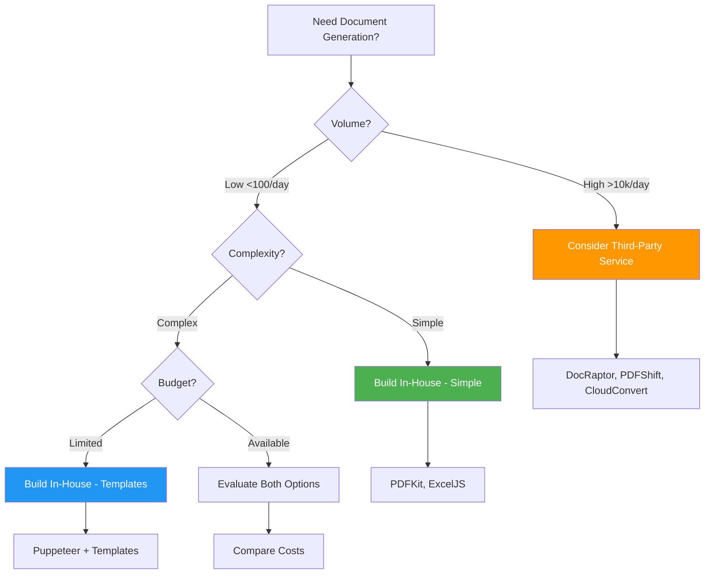

# Module 9: Document Generation & Export

## 📚 Table of Contents

- [Module 9: Document Generation \& Export](#module-9-document-generation--export)
  - [📚 Table of Contents](#-table-of-contents)
  - [Overview](#overview)
    - [Key Questions Answered](#key-questions-answered)
  - [Architecture Decision Guide](#architecture-decision-guide)
    - [Decision Matrix: Build vs Outsource](#decision-matrix-build-vs-outsource)
    - [When to Build In-House](#when-to-build-in-house)
    - [When to Use Third-Party Services](#when-to-use-third-party-services)
  - [PDF Generation](#pdf-generation)
    - [Approach 1: Puppeteer (HTML to PDF) ⭐ **RECOMMENDED FOR COMPLEX LAYOUTS**](#approach-1-puppeteer-html-to-pdf--recommended-for-complex-layouts)
      - [Complete Implementation](#complete-implementation)
      - [Create HTML Template](#create-html-template)
      - [Controller Implementation](#controller-implementation)
      - [Invoice Service (Database Integration)](#invoice-service-database-integration)
    - [Approach 2: PDFKit (Programmatic) 🔧 **FOR SIMPLE LAYOUTS**](#approach-2-pdfkit-programmatic--for-simple-layouts)
      - [Implementation](#implementation)
  - [Excel Export](#excel-export)
    - [Controller for Excel Export](#controller-for-excel-export)

---

## Overview

Document generation is a common requirement in enterprise applications. This module covers:

- **PDF Generation**: Reports, invoices, certificates, contracts
- **Excel Export**: Data exports, reports, bulk data download
- **Invoice Systems**: Professional invoice generation
- **Template Management**: Reusable templates with dynamic data
- **Performance**: Handling large datasets and heavy processing

### Key Questions Answered

✅ **Do you need HTML templates?** - Yes, for complex layouts (Approach 1)  
✅ **Need a dedicated service?** - Yes, for maintainability and reusability  
✅ **Outsource or build in-house?** - Depends on volume and complexity (see decision guide)  
✅ **How to handle large datasets?** - Use streaming and queue-based processing

---

## Architecture Decision Guide

### Decision Matrix: Build vs Outsource



### When to Build In-House

| Criteria          | Recommendation                        |
| ----------------- | ------------------------------------- |
| **Volume**        | < 10,000 documents/day                |
| **Budget**        | Limited or want full control          |
| **Customization** | Need specific layouts/branding        |
| **Data Security** | Sensitive data (HIPAA, GDPR)          |
| **Integration**   | Deep integration with existing system |
| **Complexity**    | Simple to medium layouts              |

### When to Use Third-Party Services

| Criteria           | Recommendation            |
| ------------------ | ------------------------- |
| **Volume**         | > 10,000 documents/day    |
| **Budget**         | Available for SaaS costs  |
| **Time to Market** | Need quick implementation |
| **Maintenance**    | Want zero maintenance     |
| **Scaling**        | Need auto-scaling         |
| **Complexity**     | Very complex layouts      |

---

## PDF Generation

### Approach 1: Puppeteer (HTML to PDF) ⭐ **RECOMMENDED FOR COMPLEX LAYOUTS**

**Best for:** Invoices, reports, certificates with complex designs

**Pros:**

- ✅ Use HTML/CSS for design (designer-friendly)
- ✅ Template engines (Handlebars, EJS, Pug)
- ✅ Complex layouts easy
- ✅ Responsive designs
- ✅ Print CSS support

**Cons:**

- ⚠️ Heavy (runs headless Chrome)
- ⚠️ Slower than alternatives
- ⚠️ More memory usage

#### Complete Implementation

```bash
# Install dependencies
npm install puppeteer handlebars
npm install @types/node
```

```typescript
// src/documents/services/pdf-generator.service.ts
import { Injectable, Logger } from "@nestjs/common";
import * as puppeteer from "puppeteer";
import * as Handlebars from "handlebars";
import * as fs from "fs";
import * as path from "path";

export interface PdfOptions {
  format?: "A4" | "Letter" | "Legal";
  orientation?: "portrait" | "landscape";
  margin?: {
    top?: string;
    right?: string;
    bottom?: string;
    left?: string;
  };
  displayHeaderFooter?: boolean;
  headerTemplate?: string;
  footerTemplate?: string;
}

@Injectable()
export class PdfGeneratorService {
  private readonly logger = new Logger(PdfGeneratorService.name);
  private browser: puppeteer.Browser;

  /**
   * Initialize browser on module init
   * Reuse browser instance for better performance
   */
  async onModuleInit() {
    this.browser = await puppeteer.launch({
      headless: true,
      args: ["--no-sandbox", "--disable-setuid-sandbox"], // For Docker/Linux
    });

    this.logger.log("Puppeteer browser initialized");
  }

  /**
   * Cleanup browser on module destroy
   */
  async onModuleDestroy() {
    if (this.browser) {
      await this.browser.close();
    }
  }

  /**
   * Generate PDF from HTML template
   *
   * @param templatePath - Path to Handlebars template file
   * @param data - Data to inject into template
   * @param options - PDF generation options
   * @returns PDF buffer
   */
  async generateFromTemplate(
    templatePath: string,
    data: any,
    options: PdfOptions = {}
  ): Promise<Buffer> {
    try {
      // 1. Read template file
      const templateContent = fs.readFileSync(templatePath, "utf-8");

      // 2. Compile template with Handlebars
      const template = Handlebars.compile(templateContent);

      // 3. Inject data into template
      const html = template(data);

      // 4. Generate PDF from HTML
      const pdf = await this.generateFromHtml(html, options);

      this.logger.log(
        `PDF generated from template: ${path.basename(templatePath)}`
      );
      return pdf;
    } catch (error) {
      this.logger.error(`PDF generation failed: ${error.message}`);
      throw new Error(`PDF generation failed: ${error.message}`);
    }
  }

  /**
   * Generate PDF from HTML string
   */
  async generateFromHtml(
    html: string,
    options: PdfOptions = {}
  ): Promise<Buffer> {
    const page = await this.browser.newPage();

    try {
      // Set content
      await page.setContent(html, {
        waitUntil: "networkidle0", // Wait for all resources to load
      });

      // Generate PDF
      const pdf = await page.pdf({
        format: options.format || "A4",
        landscape: options.orientation === "landscape",
        margin: options.margin || {
          top: "20mm",
          right: "15mm",
          bottom: "20mm",
          left: "15mm",
        },
        printBackground: true, // Include background colors/images
        displayHeaderFooter: options.displayHeaderFooter || false,
        headerTemplate: options.headerTemplate || "",
        footerTemplate: options.footerTemplate || "",
      });

      return Buffer.from(pdf);
    } finally {
      await page.close();
    }
  }

  /**
   * Generate PDF from URL
   * Useful for generating PDFs from existing web pages
   */
  async generateFromUrl(
    url: string,
    options: PdfOptions = {}
  ): Promise<Buffer> {
    const page = await this.browser.newPage();

    try {
      await page.goto(url, {
        waitUntil: "networkidle0",
      });

      const pdf = await page.pdf({
        format: options.format || "A4",
        landscape: options.orientation === "landscape",
        margin: options.margin,
        printBackground: true,
      });

      return Buffer.from(pdf);
    } finally {
      await page.close();
    }
  }
}
```

#### Create HTML Template

```handlebars
<!-- templates/invoice.hbs -->

<html>
  <head>
    <meta charset="UTF-8" />
    <style>
      * { margin: 0; padding: 0; box-sizing: border-box; } body { font-family:
      'Helvetica Neue', Arial, sans-serif; color: #333; line-height: 1.6; }
      .invoice-container { max-width: 800px; margin: 0 auto; padding: 40px; }
      .header { display: flex; justify-content: space-between; align-items:
      flex-start; margin-bottom: 40px; padding-bottom: 20px; border-bottom: 3px
      solid #2196F3; } .company-info h1 { color: #2196F3; font-size: 28px;
      margin-bottom: 10px; } .invoice-details { text-align: right; }
      .invoice-number { font-size: 24px; font-weight: bold; color: #2196F3;
      margin-bottom: 10px; } .billing-info { display: flex; justify-content:
      space-between; margin-bottom: 40px; } .billing-section h3 { color:
      #2196F3; margin-bottom: 10px; font-size: 14px; text-transform: uppercase;
      } .items-table { width: 100%; border-collapse: collapse; margin-bottom:
      30px; } .items-table thead { background-color: #2196F3; color: white; }
      .items-table th, .items-table td { padding: 12px; text-align: left;
      border-bottom: 1px solid #ddd; } .items-table th { font-weight: 600;
      text-transform: uppercase; font-size: 12px; } .items-table tbody tr:hover
      { background-color: #f5f5f5; } .text-right { text-align: right; } .totals
      { margin-left: auto; width: 300px; } .totals-row { display: flex;
      justify-content: space-between; padding: 10px 0; border-bottom: 1px solid
      #eee; } .totals-row.total { font-size: 18px; font-weight: bold; color:
      #2196F3; border-bottom: 3px solid #2196F3; margin-top: 10px; } .footer {
      margin-top: 60px; padding-top: 20px; border-top: 1px solid #ddd;
      text-align: center; color: #666; font-size: 12px; } .payment-info {
      margin-top: 40px; padding: 20px; background-color: #f9f9f9; border-left:
      4px solid #2196F3; } .payment-info h3 { color: #2196F3; margin-bottom:
      10px; } @media print { .invoice-container { padding: 0; } }
    </style>
  </head>
  <body>
    <div class="invoice-container">
      <!-- Header -->
      <div class="header">
        <div class="company-info">
          <h1>{{companyName}}</h1>
          <p>{{companyAddress}}</p>
          <p>{{companyCity}}, {{companyZip}}</p>
          <p>{{companyCountry}}</p>
          <p>Email: {{companyEmail}}</p>
          <p>Phone: {{companyPhone}}</p>
        </div>
        <div class="invoice-details">
          <div class="invoice-number">INVOICE #{{invoiceNumber}}</div>
          <p><strong>Date:</strong> {{invoiceDate}}</p>
          <p><strong>Due Date:</strong> {{dueDate}}</p>
        </div>
      </div>

      <!-- Billing Information -->
      <div class="billing-info">
        <div class="billing-section">
          <h3>Bill To:</h3>
          <p><strong>{{customerName}}</strong></p>
          <p>{{customerAddress}}</p>
          <p>{{customerCity}}, {{customerZip}}</p>
          <p>{{customerCountry}}</p>
          <p>{{customerEmail}}</p>
        </div>
        <div class="billing-section">
          <h3>Payment Terms:</h3>
          <p>{{paymentTerms}}</p>
          <p><strong>Status:</strong> {{status}}</p>
        </div>
      </div>

      <!-- Items Table -->
      <table class="items-table">
        <thead>
          <tr>
            <th>Description</th>
            <th>Quantity</th>
            <th class="text-right">Unit Price</th>
            <th class="text-right">Amount</th>
          </tr>
        </thead>
        <tbody>
          {{#each items}}
            <tr>
              <td>
                <strong>{{this.name}}</strong>
                {{#if this.description}}
                  <br /><small style="color: #666;">{{this.description}}</small>
                {{/if}}
              </td>
              <td>{{this.quantity}}</td>
              <td class="text-right">${{this.unitPrice}}</td>
              <td class="text-right">${{this.total}}</td>
            </tr>
          {{/each}}
        </tbody>
      </table>

      <!-- Totals -->
      <div class="totals">
        <div class="totals-row">
          <span>Subtotal:</span>
          <span>${{subtotal}}</span>
        </div>
        {{#if discount}}
          <div class="totals-row">
            <span>Discount ({{discountPercent}}%):</span>
            <span>-${{discount}}</span>
          </div>
        {{/if}}
        <div class="totals-row">
          <span>Tax ({{taxPercent}}%):</span>
          <span>${{tax}}</span>
        </div>
        <div class="totals-row total">
          <span>Total:</span>
          <span>${{total}}</span>
        </div>
      </div>

      <!-- Payment Information -->
      {{#if paymentInstructions}}
        <div class="payment-info">
          <h3>Payment Information</h3>
          <p>{{paymentInstructions}}</p>
          {{#if bankDetails}}
            <p><strong>Bank:</strong> {{bankDetails.bankName}}</p>
            <p><strong>Account:</strong> {{bankDetails.accountNumber}}</p>
            <p><strong>Routing:</strong> {{bankDetails.routingNumber}}</p>
          {{/if}}
        </div>
      {{/if}}

      <!-- Notes -->
      {{#if notes}}
        <div style="margin-top: 30px;">
          <h3 style="color: #2196F3; margin-bottom: 10px;">Notes:</h3>
          <p style="color: #666;">{{notes}}</p>
        </div>
      {{/if}}

      <!-- Footer -->
      <div class="footer">
        <p>Thank you for your business!</p>
        <p>{{companyName}} | {{companyWebsite}}</p>
      </div>
    </div>
  </body>
</html>
```

#### Controller Implementation

```typescript
// src/documents/documents.controller.ts
import {
  Controller,
  Post,
  Body,
  Res,
  HttpStatus,
  Get,
  Param,
} from "@nestjs/common";
import { Response } from "express";
import { PdfGeneratorService } from "./services/pdf-generator.service";
import { InvoiceService } from "./services/invoice.service";

@Controller("documents")
export class DocumentsController {
  constructor(
    private pdfGenerator: PdfGeneratorService,
    private invoiceService: InvoiceService
  ) {}

  /**
   * Generate invoice PDF
   */
  @Get("invoices/:id/pdf")
  async generateInvoicePdf(
    @Param("id") invoiceId: string,
    @Res() res: Response
  ) {
    try {
      // 1. Get invoice data from database
      const invoiceData = await this.invoiceService.getInvoiceData(invoiceId);

      // 2. Generate PDF from template
      const pdfBuffer = await this.pdfGenerator.generateFromTemplate(
        "templates/invoice.hbs",
        invoiceData,
        {
          format: "A4",
          margin: {
            top: "20mm",
            right: "15mm",
            bottom: "20mm",
            left: "15mm",
          },
        }
      );

      // 3. Set response headers
      res.setHeader("Content-Type", "application/pdf");
      res.setHeader(
        "Content-Disposition",
        `attachment; filename="invoice-${invoiceData.invoiceNumber}.pdf"`
      );
      res.setHeader("Content-Length", pdfBuffer.length);

      // 4. Send PDF
      res.status(HttpStatus.OK).send(pdfBuffer);
    } catch (error) {
      res.status(HttpStatus.INTERNAL_SERVER_ERROR).json({
        message: "Failed to generate PDF",
        error: error.message,
      });
    }
  }

  /**
   * Generate custom PDF from HTML
   */
  @Post("generate-pdf")
  async generateCustomPdf(
    @Body() body: { html: string; filename?: string },
    @Res() res: Response
  ) {
    const pdfBuffer = await this.pdfGenerator.generateFromHtml(body.html);

    res.setHeader("Content-Type", "application/pdf");
    res.setHeader(
      "Content-Disposition",
      `attachment; filename="${body.filename || "document"}.pdf"`
    );

    res.status(HttpStatus.OK).send(pdfBuffer);
  }
}
```

#### Invoice Service (Database Integration)

```typescript
// src/documents/services/invoice.service.ts
import { Injectable } from "@nestjs/common";
import { InjectRepository } from "@nestjs/typeorm";
import { Repository } from "typeorm";
import { Invoice } from "../entities/invoice.entity";
import { InvoiceItem } from "../entities/invoice-item.entity";

@Injectable()
export class InvoiceService {
  constructor(
    @InjectRepository(Invoice)
    private invoiceRepo: Repository<Invoice>,
    @InjectRepository(InvoiceItem)
    private invoiceItemRepo: Repository<InvoiceItem>
  ) {}

  /**
   * Get invoice data formatted for PDF template
   */
  async getInvoiceData(invoiceId: string): Promise<any> {
    // Fetch invoice with relations
    const invoice = await this.invoiceRepo.findOne({
      where: { id: invoiceId },
      relations: ["customer", "items", "company"],
    });

    if (!invoice) {
      throw new Error("Invoice not found");
    }

    // Calculate totals
    const subtotal = invoice.items.reduce(
      (sum, item) => sum + item.quantity * item.unitPrice,
      0
    );

    const discount = invoice.discountPercent
      ? (subtotal * invoice.discountPercent) / 100
      : 0;

    const taxableAmount = subtotal - discount;
    const tax = (taxableAmount * invoice.taxPercent) / 100;
    const total = taxableAmount + tax;

    // Format data for template
    return {
      // Company info
      companyName: invoice.company.name,
      companyAddress: invoice.company.address,
      companyCity: invoice.company.city,
      companyZip: invoice.company.zipCode,
      companyCountry: invoice.company.country,
      companyEmail: invoice.company.email,
      companyPhone: invoice.company.phone,
      companyWebsite: invoice.company.website,

      // Invoice details
      invoiceNumber: invoice.invoiceNumber,
      invoiceDate: this.formatDate(invoice.invoiceDate),
      dueDate: this.formatDate(invoice.dueDate),
      status: invoice.status,
      paymentTerms: invoice.paymentTerms,

      // Customer info
      customerName: invoice.customer.name,
      customerAddress: invoice.customer.address,
      customerCity: invoice.customer.city,
      customerZip: invoice.customer.zipCode,
      customerCountry: invoice.customer.country,
      customerEmail: invoice.customer.email,

      // Items with calculated totals
      items: invoice.items.map((item) => ({
        name: item.name,
        description: item.description,
        quantity: item.quantity,
        unitPrice: item.unitPrice.toFixed(2),
        total: (item.quantity * item.unitPrice).toFixed(2),
      })),

      // Totals
      subtotal: subtotal.toFixed(2),
      discount: discount > 0 ? discount.toFixed(2) : null,
      discountPercent: invoice.discountPercent || 0,
      tax: tax.toFixed(2),
      taxPercent: invoice.taxPercent,
      total: total.toFixed(2),

      // Additional info
      notes: invoice.notes,
      paymentInstructions: invoice.paymentInstructions,
      bankDetails: invoice.bankDetails,
    };
  }

  private formatDate(date: Date): string {
    return new Intl.DateTimeFormat("en-US", {
      year: "numeric",
      month: "long",
      day: "numeric",
    }).format(date);
  }
}
```

---

### Approach 2: PDFKit (Programmatic) 🔧 **FOR SIMPLE LAYOUTS**

**Best for:** Simple reports, receipts, labels, barcodes

**Pros:**

- ✅ Lightweight
- ✅ Fast performance
- ✅ Low memory usage
- ✅ Fine-grained control
- ✅ Vector graphics

**Cons:**

- ⚠️ Code-heavy for complex layouts
- ⚠️ Harder to maintain
- ⚠️ Less designer-friendly

#### Implementation

```bash
npm install pdfkit
npm install @types/pdfkit
```

```typescript
// src/documents/services/pdfkit-generator.service.ts
import { Injectable } from "@nestjs/common";
import * as PDFDocument from "pdfkit";
import { Readable } from "stream";

@Injectable()
export class PdfkitGeneratorService {
  /**
   * Generate simple invoice with PDFKit
   */
  async generateInvoice(invoiceData: any): Promise<Buffer> {
    return new Promise((resolve, reject) => {
      const doc = new PDFDocument({
        size: "A4",
        margin: 50,
      });

      const buffers: Buffer[] = [];

      // Collect PDF data
      doc.on("data", buffers.push.bind(buffers));
      doc.on("end", () => {
        const pdfBuffer = Buffer.concat(buffers);
        resolve(pdfBuffer);
      });
      doc.on("error", reject);

      // Header
      doc
        .fontSize(20)
        .fillColor("#2196F3")
        .text(invoiceData.companyName, 50, 50);

      doc
        .fontSize(10)
        .fillColor("#333")
        .text(invoiceData.companyAddress, 50, 80)
        .text(`${invoiceData.companyCity}, ${invoiceData.companyZip}`, 50, 95);

      // Invoice number (right aligned)
      doc
        .fontSize(16)
        .fillColor("#2196F3")
        .text(`INVOICE #${invoiceData.invoiceNumber}`, 350, 50, {
          width: 200,
          align: "right",
        });

      doc
        .fontSize(10)
        .fillColor("#333")
        .text(`Date: ${invoiceData.invoiceDate}`, 350, 75, {
          width: 200,
          align: "right",
        });

      // Line
      doc
        .strokeColor("#2196F3")
        .lineWidth(2)
        .moveTo(50, 120)
        .lineTo(550, 120)
        .stroke();

      // Bill To
      let yPosition = 140;
      doc.fontSize(12).fillColor("#2196F3").text("BILL TO:", 50, yPosition);

      doc
        .fontSize(10)
        .fillColor("#333")
        .text(invoiceData.customerName, 50, yPosition + 20)
        .text(invoiceData.customerAddress, 50, yPosition + 35)
        .text(
          `${invoiceData.customerCity}, ${invoiceData.customerZip}`,
          50,
          yPosition + 50
        );

      // Items table
      yPosition = 240;

      // Table header
      doc
        .fontSize(10)
        .fillColor("#fff")
        .rect(50, yPosition, 500, 20)
        .fill("#2196F3");

      doc
        .fillColor("#fff")
        .text("Description", 60, yPosition + 5)
        .text("Qty", 350, yPosition + 5)
        .text("Price", 420, yPosition + 5)
        .text("Total", 490, yPosition + 5);

      // Table rows
      yPosition += 30;
      doc.fillColor("#333");

      invoiceData.items.forEach((item: any, index: number) => {
        const bgColor = index % 2 === 0 ? "#f9f9f9" : "#fff";

        doc.rect(50, yPosition, 500, 25).fill(bgColor);

        doc
          .fillColor("#333")
          .text(item.name, 60, yPosition + 7)
          .text(item.quantity.toString(), 350, yPosition + 7)
          .text(`$${item.unitPrice}`, 420, yPosition + 7)
          .text(`$${item.total}`, 490, yPosition + 7);

        yPosition += 25;
      });

      // Totals
      yPosition += 20;
      const totalsX = 400;

      doc
        .fontSize(10)
        .text(`Subtotal:`, totalsX, yPosition)
        .text(`$${invoiceData.subtotal}`, totalsX + 90, yPosition, {
          width: 100,
          align: "right",
        });

      if (invoiceData.discount) {
        yPosition += 20;
        doc
          .text(`Discount:`, totalsX, yPosition)
          .text(`-$${invoiceData.discount}`, totalsX + 90, yPosition, {
            width: 100,
            align: "right",
          });
      }

      yPosition += 20;
      doc
        .text(`Tax:`, totalsX, yPosition)
        .text(`$${invoiceData.tax}`, totalsX + 90, yPosition, {
          width: 100,
          align: "right",
        });

      yPosition += 20;
      doc
        .fontSize(14)
        .fillColor("#2196F3")
        .text(`Total:`, totalsX, yPosition)
        .text(`$${invoiceData.total}`, totalsX + 90, yPosition, {
          width: 100,
          align: "right",
        });

      // Footer
      doc
        .fontSize(10)
        .fillColor("#666")
        .text("Thank you for your business!", 50, 750, {
          align: "center",
          width: 500,
        });

      // Finalize PDF
      doc.end();
    });
  }

  /**
   * Generate receipt
   */
  async generateReceipt(data: any): Promise<Buffer> {
    // Similar implementation for receipts
    // Simpler layout, typically smaller size
    throw new Error("Not implemented");
  }
}
```

---

## Excel Export

**Best for:** Data exports, reports, bulk downloads

```bash
npm install exceljs
```

```typescript
// src/documents/services/excel-export.service.ts
import { Injectable, Logger } from "@nestjs/common";
import * as ExcelJS from "exceljs";

@Injectable()
export class ExcelExportService {
  private readonly logger = new Logger(ExcelExportService.name);

  /**
   * Export data to Excel with formatting
   */
  async exportToExcel(
    data: any[],
    columns: Array<{ header: string; key: string; width?: number }>,
    options: {
      sheetName?: string;
      title?: string;
      creator?: string;
    } = {}
  ): Promise<Buffer> {
    // Create workbook
    const workbook = new ExcelJS.Workbook();
    workbook.creator = options.creator || "Your App";
    workbook.created = new Date();

    // Add worksheet
    const worksheet = workbook.addWorksheet(options.sheetName || "Sheet1");

    // Add title row if provided
    if (options.title) {
      worksheet.mergeCells(
        "A1",
        `${String.fromCharCode(64 + columns.length)}1`
      );
      const titleRow = worksheet.getCell("A1");
      titleRow.value = options.title;
      titleRow.font = { size: 16, bold: true };
      titleRow.alignment = { horizontal: "center", vertical: "middle" };
      worksheet.getRow(1).height = 30;

      // Add empty row
      worksheet.addRow([]);
    }

    // Define columns
    worksheet.columns = columns.map((col) => ({
      header: col.header,
      key: col.key,
      width: col.width || 15,
    }));

    // Style header row
    const headerRow = worksheet.getRow(options.title ? 3 : 1);
    headerRow.font = { bold: true, color: { argb: "FFFFFFFF" } };
    headerRow.fill = {
      type: "pattern",
      pattern: "solid",
      fgColor: { argb: "FF2196F3" },
    };
    headerRow.alignment = { horizontal: "center", vertical: "middle" };
    headerRow.height = 25;

    // Add data
    worksheet.addRows(data);

    // Apply borders to all cells
    worksheet.eachRow((row, rowNumber) => {
      row.eachCell((cell) => {
        cell.border = {
          top: { style: "thin" },
          left: { style: "thin" },
          bottom: { style: "thin" },
          right: { style: "thin" },
        };
      });

      // Alternate row colors (skip header and title)
      const dataRowStart = options.title ? 4 : 2;
      if (rowNumber >= dataRowStart && rowNumber % 2 === 0) {
        row.eachCell((cell) => {
          cell.fill = {
            type: "pattern",
            pattern: "solid",
            fgColor: { argb: "FFF9F9F9" },
          };
        });
      }
    });

    // Auto-filter
    const headerRowIndex = options.title ? 3 : 1;
    worksheet.autoFilter = {
      from: { row: headerRowIndex, column: 1 },
      to: {
        row: headerRowIndex,
        column: columns.length,
      },
    };

    // Generate buffer
    const buffer = await workbook.xlsx.writeBuffer();
    this.logger.log("Excel file generated");

    return Buffer.from(buffer);
  }

  /**
   * Export with multiple sheets
   */
  async exportMultipleSheets(
    sheets: Array<{
      name: string;
      data: any[];
      columns: Array<{ header: string; key: string; width?: number }>;
    }>
  ): Promise<Buffer> {
    const workbook = new ExcelJS.Workbook();
    workbook.creator = "Your App";
    workbook.created = new Date();

    for (const sheet of sheets) {
      const worksheet = workbook.addWorksheet(sheet.name);

      // Define columns
      worksheet.columns = sheet.columns;

      // Style header
      const headerRow = worksheet.getRow(1);
      headerRow.font = { bold: true, color: { argb: "FFFFFFFF" } };
      headerRow.fill = {
        type: "pattern",
        pattern: "solid",
        fgColor: { argb: "FF2196F3" },
      };

      // Add data
      worksheet.addRows(sheet.data);

      // Apply borders
      worksheet.eachRow((row) => {
        row.eachCell((cell) => {
          cell.border = {
            top: { style: "thin" },
            left: { style: "thin" },
            bottom: { style: "thin" },
            right: { style: "thin" },
          };
        });
      });
    }

    const buffer = await workbook.xlsx.writeBuffer();
    return Buffer.from(buffer);
  }

  /**
   * Stream large datasets
   * Use for datasets > 10,000 rows
   */
  async streamToExcel(
    dataStream: AsyncIterable<any>,
    columns: Array<{ header: string; key: string }>
  ): Promise<Buffer> {
    const workbook = new ExcelJS.stream.xlsx.WorkbookWriter({
      useStyles: true,
    });

    const worksheet = workbook.addWorksheet("Data");
    worksheet.columns = columns;

    // Style header
    const headerRow = worksheet.getRow(1);
    headerRow.font = { bold: true };
    headerRow.commit();

    // Stream data
    for await (const row of dataStream) {
      worksheet.addRow(row).commit();
    }

    worksheet.commit();
    await workbook.commit();

    // Note: For streaming, you'd typically write directly to response
    // This is simplified for demonstration
    return Buffer.from([]);
  }
}
```

#### Controller for Excel Export

```typescript
@Controller("exports")
export class ExportsController {
  constructor(
    private excelService: ExcelExportService,
    private userService: UserService
  ) {}

  /**
   * Export users to Excel
   */
  @Get("users/excel")
  async exportUsers(@Res() res: Response) {
    // Fetch data
    const users = await this.userService.findAll();

    // Prepare data
    const data = users.map((user) => ({
      id: user.id,
      name: user.name,
      email: user.email,
      role: user.role,
      createdAt: user.createdAt,
      status: user.isActive ? "Active" : "Inactive",
    }));

    // Define columns
    const columns = [
      { header: "ID", key: "id", width: 10 },
      { header: "Name", key: "name", width: 25 },
      { header: "Email", key: "email", width: 30 },
      { header: "Role", key: "role", width: 15 },
      { header: "Created At", key: "createdAt", width: 20 },
      { header: "Status", key: "status", width: 15 },
    ];

    // Generate Excel
    const excelBuffer = await this.excelService.exportToExcel(data, columns, {
      sheetName: "Users",
      title: "Users Report",
      creator: "Your Company",
    });

    // Set headers
    res.setHeader(
      "Content-Type",
      "application/vnd.openxmlformats-officedocument.spreadsheetml.sheet"
    );
    res.setHeader(
      "Content-Disposition",
      `attachment; filename="users-${Date.now()}.xlsx"`
    );

    res.send(excelBuffer);
  }

  /**
   * Export with multiple sheets
   */
  @Get("reports/multi-sheet")
  async exportMultiSheet(@Res() res: Response) {
    const [users, orders, products] = await Promise.all([
      this.userService.findAll(),
      this.orderService.findAll(),
      this.productService.findAll(),
    ]);

    const excelBuffer = await this.excelService.exportMultipleSheets([
      {
        name: "Users",
        data: users,
        columns: [
          { header: "ID", key: "id", width: 10 },
          { header: "Name", key: "name", width: 25 },
          { header: "Email", key: "email", width: 30 },
        ],
      },
      {
        name: "Orders",
        data: orders,
        columns: [
          { header: "Order ID", key: "id", width: 15 },
          { header: "Customer", key: "customerName", width: 25 },
          { header: "Total", key: "total", width: 15 },
        ],
      },
      {
        name: "Products",
        data: products,
        columns: [
          { header: "SKU", key: "sku", width: 15 },
          { header: "Name", key: "name", width: 30 },
          { header: "Price", key: "price", width: 15 },
        ],
      },
    ]);

    res.setHeader(
      "Content-Type",
      "application/vnd.openxmlformats-officedocument.spreadsheetml.sheet"
    );
    res.setHeader(
      "Content-Disposition",
      `attachment; filename="report-${Date.now()}.xlsx"`
    );

    res.send(excelBuffer);
  }
}
```

---

_Document continues with Template Management, Queue Processing, and complete mini-project..._
