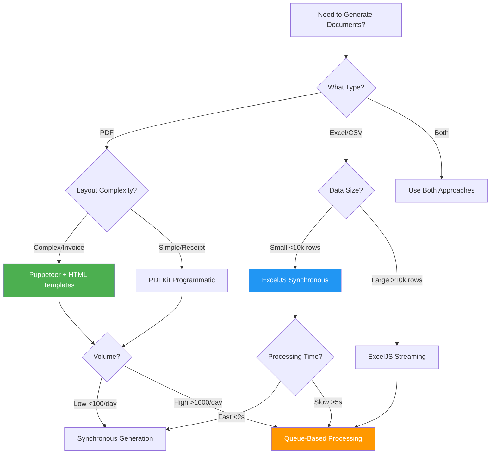

# Document Generation - Quick Reference

> **Fast decision guide for PDF, Excel, and document generation in NestJS**

---

## 🎯 Quick Decision Tree



---

## 📊 Method Comparison

| Method        | Best For               | Complexity | Speed | Memory | Templates  |
| ------------- | ---------------------- | ---------- | ----- | ------ | ---------- |
| **Puppeteer** | Invoices, Complex PDFs | High       | Slow  | High   | ✅ HTML    |
| **PDFKit**    | Receipts, Simple Docs  | Low        | Fast  | Low    | ❌ Code    |
| **ExcelJS**   | Data Exports           | Medium     | Fast  | Medium | ⚠️ Minimal |
| **Queue**     | Heavy Processing       | High       | Async | Low    | ✅ Any     |

---

## 🚀 Quick Start Examples

### 1. Simple Invoice PDF (Puppeteer)

```typescript
// Install
npm install puppeteer handlebars

// Service
@Injectable()
export class PdfService {
  async generateInvoice(data: InvoiceData): Promise<Buffer> {
    const browser = await puppeteer.launch({ headless: true });
    const page = await browser.newPage();

    // Load template
    const template = Handlebars.compile(
      fs.readFileSync('invoice.hbs', 'utf-8')
    );

    // Render with data
    await page.setContent(template(data));

    // Generate PDF
    const pdf = await page.pdf({
      format: 'A4',
      printBackground: true,
    });

    await browser.close();
    return Buffer.from(pdf);
  }
}

// Controller
@Get('invoice/:id/pdf')
async downloadInvoice(@Param('id') id: string, @Res() res: Response) {
  const data = await this.invoiceService.getData(id);
  const pdf = await this.pdfService.generateInvoice(data);

  res.setHeader('Content-Type', 'application/pdf');
  res.setHeader('Content-Disposition', 'attachment; filename="invoice.pdf"');
  res.send(pdf);
}
```

### 2. Excel Export

```typescript
// Install
npm install exceljs

// Service
@Injectable()
export class ExcelService {
  async exportUsers(users: User[]): Promise<Buffer> {
    const workbook = new ExcelJS.Workbook();
    const sheet = workbook.addWorksheet('Users');

    // Define columns
    sheet.columns = [
      { header: 'Name', key: 'name', width: 25 },
      { header: 'Email', key: 'email', width: 30 },
      { header: 'Role', key: 'role', width: 15 },
    ];

    // Style header
    sheet.getRow(1).font = { bold: true };
    sheet.getRow(1).fill = {
      type: 'pattern',
      pattern: 'solid',
      fgColor: { argb: 'FF2196F3' },
    };

    // Add data
    sheet.addRows(users);

    const buffer = await workbook.xlsx.writeBuffer();
    return Buffer.from(buffer);
  }
}

// Controller
@Get('users/export')
async exportUsers(@Res() res: Response) {
  const users = await this.userService.findAll();
  const excel = await this.excelService.exportUsers(users);

  res.setHeader('Content-Type', 'application/vnd.openxmlformats-officedocument.spreadsheetml.sheet');
  res.setHeader('Content-Disposition', 'attachment; filename="users.xlsx"');
  res.send(excel);
}
```

### 3. Queue-Based Processing

```typescript
// Install
npm install @nestjs/bull bull

// Module
@Module({
  imports: [
    BullModule.registerQueue({
      name: 'documents',
    }),
  ],
})

// Controller - Queue Job
@Post('report/generate')
async generateReport(@Body() params: any) {
  const job = await this.documentQueue.add('generate-report', params);

  return {
    jobId: job.id,
    status: 'processing',
    checkUrl: `/jobs/${job.id}`,
  };
}

// Processor
@Processor('documents')
export class DocumentProcessor {
  @Process('generate-report')
  async handleReport(job: Job) {
    const { params } = job.data;

    // Generate PDF
    const pdf = await this.pdfService.generate(params);

    // Upload to S3
    const url = await this.s3Service.upload(pdf);

    return { url };
  }
}

// Check Status
@Get('jobs/:id')
async checkJob(@Param('id') id: string) {
  const job = await this.documentQueue.getJob(id);

  return {
    id: job.id,
    progress: await job.progress(),
    state: await job.getState(),
    result: job.returnvalue,
  };
}
```

---

## 🎨 HTML Template Example

```handlebars
<!-- invoice.hbs -->

<html>
  <head>
    <style>
      body { font-family: Arial; } .header { background: #2196F3; color: white;
      padding: 20px; } .total { font-size: 24px; font-weight: bold; color:
      #2196F3; }
    </style>
  </head>
  <body>
    <div class="header">
      <h1>{{companyName}}</h1>
      <p>Invoice #{{invoiceNumber}}</p>
    </div>

    <h3>Bill To: {{customerName}}</h3>

    <table>
      <thead>
        <tr>
          <th>Item</th>
          <th>Qty</th>
          <th>Price</th>
          <th>Total</th>
        </tr>
      </thead>
      <tbody>
        {{#each items}}
          <tr>
            <td>{{name}}</td>
            <td>{{quantity}}</td>
            <td>${{unitPrice}}</td>
            <td>${{total}}</td>
          </tr>
        {{/each}}
      </tbody>
    </table>

    <div class="total">
      Total: ${{total}}
    </div>
  </body>
</html>
```

---

## 🎓 Common Patterns

### Pattern 1: Sync PDF Download

```
Client → Request PDF → Generate → Return PDF Buffer
```

**Use When:** Small PDFs, low traffic, fast generation (<2s)

### Pattern 2: Async with Queue

```
Client → Request → Queue Job → Return JobID → Poll Status → Download
```

**Use When:** Large PDFs, high traffic, slow generation (>5s)

### Pattern 3: Cached Generation

```
Client → Request → Check Cache → If Cached: Return → Else: Generate & Cache
```

**Use When:** Same documents requested multiple times

---

## 📦 Package Sizes

| Package        | Size   | Load Time | Best For        |
| -------------- | ------ | --------- | --------------- |
| **Puppeteer**  | ~300MB | Slow      | Complex layouts |
| **PDFKit**     | ~2MB   | Fast      | Simple layouts  |
| **ExcelJS**    | ~5MB   | Medium    | Data exports    |
| **Handlebars** | ~500KB | Fast      | Templates       |

---

## 💰 Cost Estimation

### Self-Hosted (10,000 docs/month)

```
Server (Puppeteer): $50/month
+ Storage (S3): $5/month
+ Redis (Queue): $10/month
= $65/month
```

### Third-Party (DocRaptor)

```
Base Plan: $15/month
+ Overages (10k docs): $200/month
= $215/month
```

**Break-even:** ~3,000 documents/month

---

## ⚡ Performance Tips

### 1. Reuse Browser Instance (Puppeteer)

```typescript
// ❌ Bad - New browser per request
async generate() {
  const browser = await puppeteer.launch();
  // ... use browser
  await browser.close();
}

// ✅ Good - Reuse singleton
private browser: Browser;

async onModuleInit() {
  this.browser = await puppeteer.launch();
}

async generate() {
  const page = await this.browser.newPage();
  // ... use page
  await page.close();
}
```

### 2. Stream Large Excel Files

```typescript
// ❌ Bad - Load all into memory
const users = await this.userRepo.find(); // 100k records
const excel = await this.excelService.generate(users);

// ✅ Good - Stream data
const workbook = new ExcelJS.stream.xlsx.WorkbookWriter();
const sheet = workbook.addWorksheet();

for await (const batch of this.userRepo.findInBatches(1000)) {
  batch.forEach((user) => sheet.addRow(user));
}
```

### 3. Use Queues for Heavy Tasks

```typescript
// ❌ Bad - Block HTTP request
@Get('report')
async getReport() {
  const pdf = await this.heavyGeneration(); // 30 seconds
  return pdf;
}

// ✅ Good - Queue and poll
@Post('report')
async requestReport() {
  const job = await this.queue.add('report', {});
  return { jobId: job.id };
}
```

---

## 🔧 Troubleshooting

| Problem                | Solution                                          |
| ---------------------- | ------------------------------------------------- |
| **Puppeteer timeout**  | Increase timeout: `page.setDefaultTimeout(60000)` |
| **Out of memory**      | Use streaming or chunk processing                 |
| **Slow generation**    | Use queue-based processing                        |
| **Template not found** | Check file paths are absolute                     |
| **Fonts missing**      | Install system fonts or embed in HTML             |
| **Images broken**      | Use absolute URLs or base64 encoding              |
| **Zombie processes**   | Always close browsers/pages                       |

---

## 📚 Learning Path

1. **Start:** Simple PDF with Puppeteer
2. **Then:** Excel export with ExcelJS
3. **Next:** Template management
4. **Advanced:** Queue-based processing
5. **Expert:** Multi-tenant customization

---

## 🔗 Resources

- [Main Documentation](./09-document-generation-export.md)
- [Advanced Patterns](./09-document-generation-part2.md)
- [Puppeteer Docs](https://pptr.dev/)
- [ExcelJS GitHub](https://github.com/exceljs/exceljs)
- [Handlebars Guide](https://handlebarsjs.com/)
- [Bull Queue Docs](https://docs.bullmq.io/)

---

**Questions Answered:**

✅ **Need HTML templates?** Yes for complex layouts  
✅ **Dedicated service?** Yes, always separate concerns  
✅ **Outsource?** Depends on volume and budget  
✅ **Database data?** Fetch, format, inject into templates  
✅ **Multi-page PDFs?** Puppeteer handles automatically with page breaks

---

_Created for quick NestJS document generation reference_ 📄
