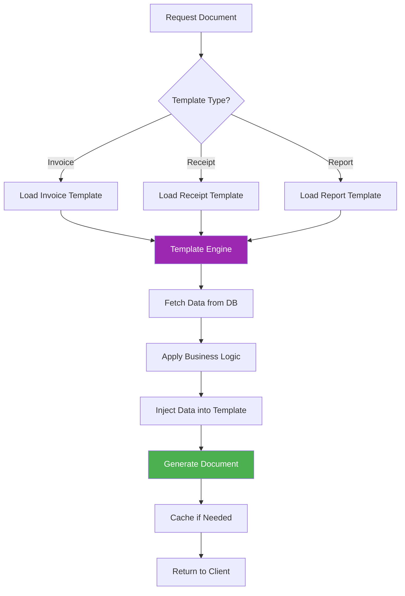
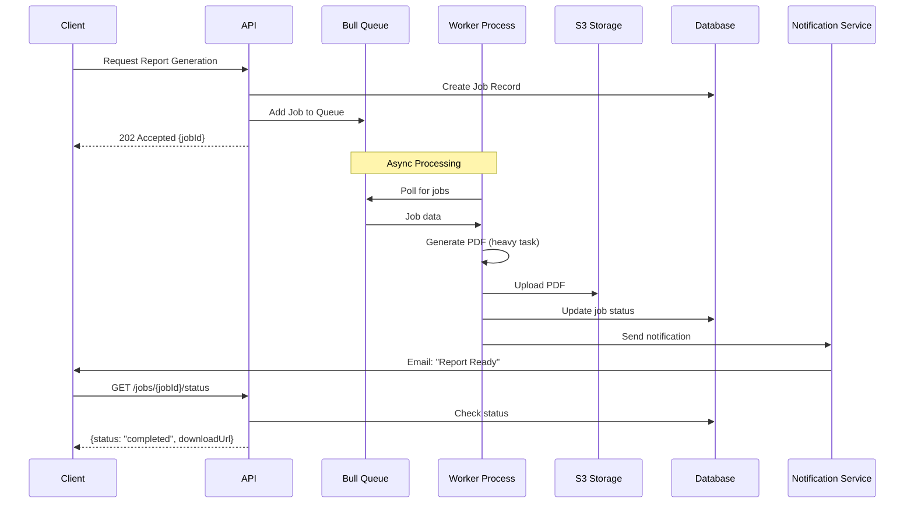

# Document Generation - Part 2: Advanced Patterns

> **Continuation of [09-document-generation-export.md](./09-document-generation-export.md)**

---

## Template Management System

Create a reusable, maintainable template management system for multi-tenant applications.

### Architecture



### Complete Template Service

```typescript
// src/documents/services/template-manager.service.ts
import { Injectable, Logger, NotFoundException } from "@nestjs/common";
import { ConfigService } from "@nestjs/config";
import * as Handlebars from "handlebars";
import * as fs from "fs/promises";
import * as path from "path";

export interface Template {
  id: string;
  name: string;
  type: "invoice" | "receipt" | "report" | "certificate" | "contract";
  content: string;
  compiled?: HandlebarsTemplateDelegate;
  metadata?: {
    version: string;
    author: string;
    description: string;
    lastModified: Date;
  };
}

@Injectable()
export class TemplateManagerService {
  private readonly logger = new Logger(TemplateManagerService.name);
  private templatesCache = new Map<string, Template>();
  private templateDir: string;

  constructor(private configService: ConfigService) {
    this.templateDir = this.configService.get("TEMPLATE_DIR", "./templates");
    this.registerHelpers();
  }

  /**
   * Initialize: Load all templates on startup
   */
  async onModuleInit() {
    await this.loadAllTemplates();
    this.logger.log(`Loaded ${this.templatesCache.size} templates`);
  }

  /**
   * Register Handlebars helpers
   * These are custom functions available in templates
   */
  private registerHelpers() {
    // Format currency
    Handlebars.registerHelper("currency", (value: number) => {
      return new Intl.NumberFormat("en-US", {
        style: "currency",
        currency: "USD",
      }).format(value);
    });

    // Format date
    Handlebars.registerHelper("formatDate", (date: Date, format: string) => {
      const options: Intl.DateTimeFormatOptions = {};

      if (format === "long") {
        options.year = "numeric";
        options.month = "long";
        options.day = "numeric";
      } else if (format === "short") {
        options.year = "2-digit";
        options.month = "2-digit";
        options.day = "2-digit";
      }

      return new Intl.DateTimeFormat("en-US", options).format(new Date(date));
    });

    // Uppercase
    Handlebars.registerHelper("uppercase", (str: string) => {
      return str ? str.toUpperCase() : "";
    });

    // Math operations
    Handlebars.registerHelper("add", (a: number, b: number) => a + b);
    Handlebars.registerHelper("subtract", (a: number, b: number) => a - b);
    Handlebars.registerHelper("multiply", (a: number, b: number) => a * b);
    Handlebars.registerHelper("divide", (a: number, b: number) => a / b);

    // Conditional helpers
    Handlebars.registerHelper("eq", (a: any, b: any) => a === b);
    Handlebars.registerHelper("gt", (a: number, b: number) => a > b);
    Handlebars.registerHelper("lt", (a: number, b: number) => a < b);

    // Array helpers
    Handlebars.registerHelper("length", (array: any[]) => array?.length || 0);

    this.logger.log("Handlebars helpers registered");
  }

  /**
   * Load all templates from directory
   */
  private async loadAllTemplates(): Promise<void> {
    try {
      const files = await fs.readdir(this.templateDir);
      const hbsFiles = files.filter((file) => file.endsWith(".hbs"));

      for (const file of hbsFiles) {
        const templatePath = path.join(this.templateDir, file);
        const content = await fs.readFile(templatePath, "utf-8");

        const templateId = path.parse(file).name;
        const compiled = Handlebars.compile(content);

        this.templatesCache.set(templateId, {
          id: templateId,
          name: templateId,
          type: this.inferTemplateType(templateId),
          content,
          compiled,
          metadata: {
            version: "1.0",
            author: "System",
            description: `Template for ${templateId}`,
            lastModified: new Date(),
          },
        });
      }
    } catch (error) {
      this.logger.error(`Failed to load templates: ${error.message}`);
      throw error;
    }
  }

  /**
   * Get template by ID
   */
  getTemplate(templateId: string): Template {
    const template = this.templatesCache.get(templateId);

    if (!template) {
      throw new NotFoundException(`Template ${templateId} not found`);
    }

    return template;
  }

  /**
   * Render template with data
   */
  render(templateId: string, data: any): string {
    const template = this.getTemplate(templateId);

    if (!template.compiled) {
      template.compiled = Handlebars.compile(template.content);
    }

    return template.compiled(data);
  }

  /**
   * Create or update template
   */
  async saveTemplate(
    templateId: string,
    content: string,
    type: Template["type"]
  ): Promise<Template> {
    const templatePath = path.join(this.templateDir, `${templateId}.hbs`);

    await fs.writeFile(templatePath, content, "utf-8");

    const compiled = Handlebars.compile(content);
    const template: Template = {
      id: templateId,
      name: templateId,
      type,
      content,
      compiled,
      metadata: {
        version: "1.0",
        author: "Admin",
        description: `${type} template`,
        lastModified: new Date(),
      },
    };

    this.templatesCache.set(templateId, template);
    this.logger.log(`Template saved: ${templateId}`);

    return template;
  }

  /**
   * Delete template
   */
  async deleteTemplate(templateId: string): Promise<void> {
    const templatePath = path.join(this.templateDir, `${templateId}.hbs`);

    await fs.unlink(templatePath);
    this.templatesCache.delete(templateId);

    this.logger.log(`Template deleted: ${templateId}`);
  }

  /**
   * List all templates
   */
  listTemplates(): Template[] {
    return Array.from(this.templatesCache.values()).map((t) => ({
      ...t,
      compiled: undefined, // Don't expose compiled function
    }));
  }

  /**
   * Reload templates (useful for development)
   */
  async reloadTemplates(): Promise<void> {
    this.templatesCache.clear();
    await this.loadAllTemplates();
    this.logger.log("Templates reloaded");
  }

  private inferTemplateType(templateId: string): Template["type"] {
    if (templateId.includes("invoice")) return "invoice";
    if (templateId.includes("receipt")) return "receipt";
    if (templateId.includes("report")) return "report";
    if (templateId.includes("certificate")) return "certificate";
    if (templateId.includes("contract")) return "contract";
    return "report";
  }
}
```

### Multi-Tenant Template System

```typescript
// src/documents/services/multi-tenant-template.service.ts
import { Injectable } from "@nestjs/common";
import { TemplateManagerService, Template } from "./template-manager.service";
import { InjectRepository } from "@nestjs/typeorm";
import { Repository } from "typeorm";
import { TenantTemplate } from "../entities/tenant-template.entity";

@Injectable()
export class MultiTenantTemplateService {
  constructor(
    private templateManager: TemplateManagerService,
    @InjectRepository(TenantTemplate)
    private tenantTemplateRepo: Repository<TenantTemplate>
  ) {}

  /**
   * Get template for specific tenant
   * Falls back to default if tenant doesn't have custom template
   */
  async getTenantTemplate(
    tenantId: string,
    templateType: Template["type"]
  ): Promise<Template> {
    // Try to find tenant-specific template
    const tenantTemplate = await this.tenantTemplateRepo.findOne({
      where: {
        tenantId,
        type: templateType,
        isActive: true,
      },
    });

    if (tenantTemplate) {
      // Return tenant's custom template
      return {
        id: tenantTemplate.id,
        name: tenantTemplate.name,
        type: tenantTemplate.type,
        content: tenantTemplate.content,
        compiled: Handlebars.compile(tenantTemplate.content),
        metadata: {
          version: tenantTemplate.version,
          author: tenantTemplate.author,
          description: tenantTemplate.description,
          lastModified: tenantTemplate.updatedAt,
        },
      };
    }

    // Fall back to default template
    return this.templateManager.getTemplate(`default-${templateType}`);
  }

  /**
   * Create custom template for tenant
   */
  async createTenantTemplate(
    tenantId: string,
    type: Template["type"],
    content: string,
    name: string
  ): Promise<TenantTemplate> {
    const template = this.tenantTemplateRepo.create({
      tenantId,
      type,
      content,
      name,
      version: "1.0",
      isActive: true,
    });

    return await this.tenantTemplateRepo.save(template);
  }

  /**
   * Render template with tenant branding
   */
  async renderForTenant(
    tenantId: string,
    templateType: Template["type"],
    data: any
  ): Promise<string> {
    const template = await this.getTenantTemplate(tenantId, templateType);

    // Add tenant branding data
    const tenantData = await this.getTenantBranding(tenantId);
    const mergedData = {
      ...data,
      branding: tenantData,
    };

    return template.compiled(mergedData);
  }

  private async getTenantBranding(tenantId: string) {
    // Fetch tenant branding (logo, colors, etc.)
    return {
      logo: "https://example.com/tenant-logo.png",
      primaryColor: "#2196F3",
      secondaryColor: "#FFC107",
      companyName: "Tenant Company",
    };
  }
}
```

---

## Queue-Based Processing

For heavy document generation (large PDFs, bulk exports), use queues to avoid blocking HTTP requests.

### Architecture



### Implementation

```bash
npm install @nestjs/bull bull
npm install @types/bull
```

```typescript
// src/documents/documents.module.ts
import { Module } from "@nestjs/common";
import { BullModule } from "@nestjs/bull";
import { DocumentsController } from "./documents.controller";
import { PdfGeneratorService } from "./services/pdf-generator.service";
import { DocumentProcessor } from "./processors/document.processor";

@Module({
  imports: [
    BullModule.registerQueue({
      name: "documents",
      redis: {
        host: "localhost",
        port: 6379,
      },
    }),
  ],
  controllers: [DocumentsController],
  providers: [PdfGeneratorService, DocumentProcessor],
})
export class DocumentsModule {}

// src/documents/entities/document-job.entity.ts
import {
  Entity,
  PrimaryGeneratedColumn,
  Column,
  CreateDateColumn,
  UpdateDateColumn,
} from "typeorm";

export enum JobStatus {
  PENDING = "pending",
  PROCESSING = "processing",
  COMPLETED = "completed",
  FAILED = "failed",
}

export enum DocumentType {
  INVOICE = "invoice",
  REPORT = "report",
  BULK_EXPORT = "bulk-export",
}

@Entity("document_jobs")
export class DocumentJob {
  @PrimaryGeneratedColumn("uuid")
  id: string;

  @Column()
  userId: string;

  @Column({
    type: "enum",
    enum: DocumentType,
  })
  type: DocumentType;

  @Column({
    type: "enum",
    enum: JobStatus,
    default: JobStatus.PENDING,
  })
  status: JobStatus;

  @Column({ type: "json", nullable: true })
  params: any;

  @Column({ nullable: true })
  downloadUrl: string;

  @Column({ nullable: true })
  errorMessage: string;

  @Column({ type: "int", default: 0 })
  progress: number; // 0-100

  @CreateDateColumn()
  createdAt: Date;

  @UpdateDateColumn()
  updatedAt: Date;

  @Column({ type: "timestamp", nullable: true })
  completedAt: Date;
}

// src/documents/processors/document.processor.ts
import { Process, Processor } from "@nestjs/bull";
import { Logger } from "@nestjs/common";
import { Job } from "bull";
import { PdfGeneratorService } from "../services/pdf-generator.service";
import { S3Service } from "../../files/services/s3.service";
import { InjectRepository } from "@nestjs/typeorm";
import { Repository } from "typeorm";
import { DocumentJob, JobStatus } from "../entities/document-job.entity";

@Processor("documents")
export class DocumentProcessor {
  private readonly logger = new Logger(DocumentProcessor.name);

  constructor(
    private pdfGenerator: PdfGeneratorService,
    private s3Service: S3Service,
    @InjectRepository(DocumentJob)
    private jobRepo: Repository<DocumentJob>
  ) {}

  /**
   * Process invoice generation
   */
  @Process("generate-invoice")
  async handleInvoiceGeneration(job: Job) {
    const { jobId, invoiceData } = job.data;

    this.logger.log(`Processing invoice generation: ${jobId}`);

    try {
      // Update status to processing
      await this.updateJobStatus(jobId, JobStatus.PROCESSING, 10);

      // Generate PDF
      await job.progress(30);
      const pdfBuffer = await this.pdfGenerator.generateFromTemplate(
        "templates/invoice.hbs",
        invoiceData
      );

      // Upload to S3
      await job.progress(60);
      const s3Key = `invoices/${Date.now()}-invoice.pdf`;
      const url = await this.s3Service.uploadBuffer(
        pdfBuffer,
        s3Key,
        "application/pdf"
      );

      // Update job with download URL
      await job.progress(90);
      await this.updateJobStatus(jobId, JobStatus.COMPLETED, 100, url);

      // TODO: Send notification
      // await this.notificationService.sendEmail(...)

      await job.progress(100);
      this.logger.log(`Invoice generation completed: ${jobId}`);

      return { success: true, url };
    } catch (error) {
      this.logger.error(`Invoice generation failed: ${error.message}`);
      await this.updateJobStatus(
        jobId,
        JobStatus.FAILED,
        0,
        null,
        error.message
      );
      throw error;
    }
  }

  /**
   * Process bulk export
   */
  @Process("bulk-export")
  async handleBulkExport(job: Job) {
    const { jobId, query, format } = job.data;

    this.logger.log(`Processing bulk export: ${jobId}`);

    try {
      await this.updateJobStatus(jobId, JobStatus.PROCESSING, 5);

      // Fetch data in chunks
      const data = await this.fetchDataInChunks(query, (progress) => {
        job.progress(progress * 0.5); // 0-50%
      });

      await job.progress(60);

      // Generate file based on format
      let fileBuffer: Buffer;
      let contentType: string;
      let extension: string;

      if (format === "excel") {
        // Use streaming for large datasets
        fileBuffer = await this.generateExcel(data);
        contentType =
          "application/vnd.openxmlformats-officedocument.spreadsheetml.sheet";
        extension = "xlsx";
      } else {
        fileBuffer = await this.generateCSV(data);
        contentType = "text/csv";
        extension = "csv";
      }

      await job.progress(80);

      // Upload to S3
      const s3Key = `exports/${Date.now()}-export.${extension}`;
      const url = await this.s3Service.uploadBuffer(
        fileBuffer,
        s3Key,
        contentType
      );

      await this.updateJobStatus(jobId, JobStatus.COMPLETED, 100, url);
      await job.progress(100);

      return { success: true, url };
    } catch (error) {
      this.logger.error(`Bulk export failed: ${error.message}`);
      await this.updateJobStatus(
        jobId,
        JobStatus.FAILED,
        0,
        null,
        error.message
      );
      throw error;
    }
  }

  private async updateJobStatus(
    jobId: string,
    status: JobStatus,
    progress: number,
    downloadUrl: string = null,
    errorMessage: string = null
  ) {
    const updateData: any = { status, progress };

    if (downloadUrl) updateData.downloadUrl = downloadUrl;
    if (errorMessage) updateData.errorMessage = errorMessage;
    if (status === JobStatus.COMPLETED) updateData.completedAt = new Date();

    await this.jobRepo.update(jobId, updateData);
  }

  private async fetchDataInChunks(
    query: any,
    onProgress: (progress: number) => void
  ): Promise<any[]> {
    // Implementation for fetching data in chunks
    // Update progress as chunks are fetched
    return [];
  }

  private async generateExcel(data: any[]): Promise<Buffer> {
    // Use ExcelJS with streaming
    return Buffer.from([]);
  }

  private async generateCSV(data: any[]): Promise<Buffer> {
    // Generate CSV
    return Buffer.from([]);
  }
}

// src/documents/documents.controller.ts
import { Controller, Post, Get, Param, Body, UseGuards } from "@nestjs/common";
import { InjectQueue } from "@nestjs/bull";
import { Queue } from "bull";
import { InjectRepository } from "@nestjs/typeorm";
import { Repository } from "typeorm";
import {
  DocumentJob,
  JobStatus,
  DocumentType,
} from "./entities/document-job.entity";
import { JwtAuthGuard } from "../auth/guards/jwt-auth.guard";
import { CurrentUser } from "../auth/decorators/current-user.decorator";

@Controller("documents")
@UseGuards(JwtAuthGuard)
export class DocumentsController {
  constructor(
    @InjectQueue("documents") private documentQueue: Queue,
    @InjectRepository(DocumentJob)
    private jobRepo: Repository<DocumentJob>
  ) {}

  /**
   * Request invoice generation (async)
   */
  @Post("invoices/:id/generate")
  async generateInvoiceAsync(
    @Param("id") invoiceId: string,
    @CurrentUser() user: any
  ) {
    // Create job record
    const job = this.jobRepo.create({
      userId: user.id,
      type: DocumentType.INVOICE,
      status: JobStatus.PENDING,
      params: { invoiceId },
    });

    const savedJob = await this.jobRepo.save(job);

    // Add to queue
    await this.documentQueue.add("generate-invoice", {
      jobId: savedJob.id,
      invoiceData: { invoiceId }, // Simplified
    });

    return {
      message: "Invoice generation started",
      jobId: savedJob.id,
      statusUrl: `/documents/jobs/${savedJob.id}`,
    };
  }

  /**
   * Request bulk export (async)
   */
  @Post("export")
  async requestBulkExport(
    @Body() body: { query: any; format: "excel" | "csv" },
    @CurrentUser() user: any
  ) {
    const job = this.jobRepo.create({
      userId: user.id,
      type: DocumentType.BULK_EXPORT,
      status: JobStatus.PENDING,
      params: body,
    });

    const savedJob = await this.jobRepo.save(job);

    await this.documentQueue.add("bulk-export", {
      jobId: savedJob.id,
      query: body.query,
      format: body.format,
    });

    return {
      message: "Export started",
      jobId: savedJob.id,
      statusUrl: `/documents/jobs/${savedJob.id}`,
    };
  }

  /**
   * Check job status
   */
  @Get("jobs/:id")
  async getJobStatus(@Param("id") jobId: string, @CurrentUser() user: any) {
    const job = await this.jobRepo.findOne({
      where: { id: jobId, userId: user.id },
    });

    if (!job) {
      throw new NotFoundException("Job not found");
    }

    return {
      id: job.id,
      type: job.type,
      status: job.status,
      progress: job.progress,
      downloadUrl: job.downloadUrl,
      errorMessage: job.errorMessage,
      createdAt: job.createdAt,
      completedAt: job.completedAt,
    };
  }

  /**
   * List user's jobs
   */
  @Get("jobs")
  async listJobs(@CurrentUser() user: any) {
    const jobs = await this.jobRepo.find({
      where: { userId: user.id },
      order: { createdAt: "DESC" },
      take: 50,
    });

    return jobs;
  }
}
```

---

## Third-Party Services Comparison

### When to Consider Third-Party

| Service          | Best For                | Pricing          | Pros                            | Cons                  |
| ---------------- | ----------------------- | ---------------- | ------------------------------- | --------------------- |
| **DocRaptor**    | Complex PDFs from HTML  | $15/mo + usage   | Easy integration, great quality | Costly at scale       |
| **PDFShift**     | Simple HTML to PDF      | $9/mo + usage    | Fast, reliable                  | Limited customization |
| **CloudConvert** | Multi-format conversion | Pay-per-use      | Supports many formats           | Can be expensive      |
| **Gotenberg**    | Self-hosted PDF service | Free (self-host) | Full control, free              | Maintenance overhead  |
| **IronPDF**      | .NET-friendly           | $599/yr          | Feature-rich                    | Expensive             |

### Cost Comparison Example

**Scenario:** 10,000 PDFs/month

| Approach                       | Monthly Cost  | Setup Time | Maintenance |
| ------------------------------ | ------------- | ---------- | ----------- |
| **Build In-House (Puppeteer)** | ~$50 (server) | 2-3 days   | Medium      |
| **DocRaptor**                  | ~$250         | 2 hours    | None        |
| **Self-Hosted Gotenberg**      | ~$30 (server) | 1 day      | Low         |

---

## Best Practices Summary

### ✅ Do's

1. **Use Templates** for maintainability
2. **Queue Heavy Tasks** (>5 seconds)
3. **Cache Results** when possible
4. **Stream Large Datasets** in exports
5. **Validate Data** before generation
6. **Set Timeouts** to prevent hanging
7. **Monitor Performance** and failures
8. **Provide Progress Updates** for long-running tasks

### ❌ Don'ts

1. **Don't block HTTP requests** with heavy processing
2. **Don't load entire datasets** into memory
3. **Don't ignore error handling**
4. **Don't forget cleanup** (temp files)
5. **Don't skip testing** with real data volumes
6. **Don't hardcode** styles in code (use templates)

---

_For complete implementation, see the main documentation and mini-project._
