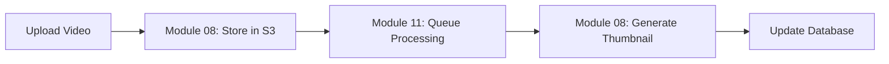
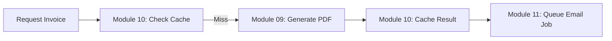

# Advanced Features - Documentation Guide

> **Navigation guide for all Advanced NestJS features documentation**

---

## 📂 Documentation Structure

### **Module 07: APIs & Integration**

Integration with external services and API documentation

- **[07-apis-and-integration.md](./07-apis-and-integration.md)** - REST API integration, HTTP client patterns
- **[07b-api-documentation-scalar.md](./07b-api-documentation-scalar.md)** - Scalar API documentation setup

---

### **Module 08: File Handling & Media**

Complete file upload, storage, and media processing guide

#### Core Documentation

- **[08-file-handling-media.md](./08-file-handling-media.md)** ⭐ **START HERE**
  - Overview & architecture patterns
  - Multer vs Cloud Storage decision guide
  - **Scenario 1:** Multer WITH Cloud Storage (production pattern)
  - Basic file upload, validation, and processing
  - AWS S3 integration
  - Image processing with Sharp

#### Supplementary Guides

- **[08a-file-upload-quick-reference.md](./08a-file-upload-quick-reference.md)** 🚀 **QUICK START**

  - Decision flowchart
  - Code templates
  - Common patterns
  - Use case examples

- **[08b-file-upload-scenarios.md](./08b-file-upload-scenarios.md)** 📘

  - **Scenario 2:** Direct Cloud Upload (presigned URLs)
  - **Scenario 3:** Hybrid Upload Strategy
  - **Scenario 4:** Image Processing Pipeline

- **[08c-file-upload-advanced.md](./08c-file-upload-advanced.md)** 🔥
  - **Scenario 5:** Large File Chunking (multipart upload)
  - **Scenario 6:** Multi-Cloud Strategy
  - **Scenario 7:** Virus Scanning Pipeline

**📚 Learning Path:**

1. Start: [Quick Reference](./08a-file-upload-quick-reference.md) (5 min)
2. Core: [Main Guide - Scenario 1](./08-file-handling-media.md) (30 min)
3. Advanced: [Direct Upload - Scenario 2](./08b-file-upload-scenarios.md) (20 min)
4. Expert: [Multipart Upload - Scenario 5](./08c-file-upload-advanced.md) (30 min)

---

### **Module 09: Document Generation & Export**

PDF, Excel, and invoice generation systems

#### Core Documentation

- **[09-document-generation-export.md](./09-document-generation-export.md)** ⭐ **START HERE**
  - Architecture decision guide (build vs outsource)
  - **PDF Approach 1:** Puppeteer + HTML templates (complex layouts)
  - **PDF Approach 2:** PDFKit (simple documents)
  - **Excel Export:** ExcelJS with formatting
  - Complete invoice system with HTML templates

#### Supplementary Guides

- **[09a-document-generation-quick-reference.md](./09a-document-generation-quick-reference.md)** 🚀 **QUICK START**

  - Decision tree
  - Quick start examples
  - Performance tips
  - Cost estimation

- **[09b-document-generation-advanced.md](./09b-document-generation-advanced.md)** 📘
  - Template management system
  - Multi-tenant templates
  - Queue-based processing (Bull)
  - Third-party service comparison

**📚 Learning Path:**

1. Start: [Quick Reference](./09a-document-generation-quick-reference.md) (5 min)
2. Basic: [Main Guide - Puppeteer](./09-document-generation-export.md) (40 min)
3. Advanced: [Template System & Queues](./09b-document-generation-advanced.md) (30 min)

---

### **Module 10: Caching with Redis**

- **[10-caching-with-redis.md](./10-caching-with-redis.md)**
  - Redis integration
  - Cache strategies
  - Performance optimization

---

### **Module 11: Background Jobs & Queues**

- **[11-background-jobs-queues.md](./11-background-jobs-queues.md)**
  - Bull queue setup
  - Job processing
  - Async task handling

---

## 🎯 Quick Navigation by Use Case

### "I need to upload files to S3"

→ [08a-file-upload-quick-reference.md](./08a-file-upload-quick-reference.md) → **Pattern 1: Multer + Cloud**

### "I need to generate PDF invoices"

→ [09a-document-generation-quick-reference.md](./09a-document-generation-quick-reference.md) → **Puppeteer Example**

### "I need to export data to Excel"

→ [09-document-generation-export.md](./09-document-generation-export.md#excel-export)

### "I need to handle large file uploads (>100MB)"

→ [08c-file-upload-advanced.md](./08c-file-upload-advanced.md#scenario-5-large-file-upload-with-chunking)

### "Users upload directly to S3 (no server)"

→ [08b-file-upload-scenarios.md](./08b-file-upload-scenarios.md#scenario-2-direct-cloud-upload)

### "I need to process images (thumbnails, resize)"

→ [08-file-handling-media.md](./08-file-handling-media.md#scenario-1-multer-with-cloud-storage) → **Step 4: Image Processing**

### "Generate PDFs without blocking requests"

→ [09b-document-generation-advanced.md](./09b-document-generation-advanced.md#queue-based-processing)

### "Multi-tenant invoice templates"

→ [09b-document-generation-advanced.md](./09b-document-generation-advanced.md#multi-tenant-template-system)

---

## 📊 Feature Comparison Matrix

| Feature        | Module 08: File Upload    | Module 09: Documents         |
| -------------- | ------------------------- | ---------------------------- |
| **Main Use**   | Upload/Store files        | Generate/Export files        |
| **Direction**  | Client → Server → Storage | Server → Generate → Client   |
| **Tools**      | Multer, Sharp, S3 SDK     | Puppeteer, PDFKit, ExcelJS   |
| **Output**     | Files stored in cloud     | Files sent to user           |
| **Processing** | Image resize, validation  | PDF/Excel generation         |
| **Queue**      | Optional (for processing) | Recommended (for generation) |

---

## 🔗 Cross-Module Connections

### File Upload + Document Generation

**Use Case:** User uploads data file → Process → Generate report


### File Upload + Background Jobs

**Use Case:** Large video upload → Queue processing → Generate thumbnail



### Document Generation + Caching + Queues

**Use Case:** Generate invoice → Cache → Queue for email



---

## 🎓 Recommended Learning Order

### Beginner Path

1. ✅ **Module 07** - APIs & Integration (foundation)
2. ✅ **Module 08** - File Upload basics
3. ✅ **Module 09** - Simple PDF generation
4. ✅ **Module 10** - Basic caching

### Intermediate Path

1. ✅ **Module 08** - Complete all scenarios
2. ✅ **Module 09** - Template management
3. ✅ **Module 11** - Background jobs introduction

### Advanced Path

1. ✅ **Module 08c** - Multipart uploads, multi-cloud
2. ✅ **Module 09b** - Queue-based generation
3. ✅ **Module 11** - Complete queue patterns
4. ✅ Integration patterns across modules

---

## 📈 Complexity Ratings

| Document                  | Complexity         | Time to Master | Prerequisites  |
| ------------------------- | ------------------ | -------------- | -------------- |
| **08a - Quick Reference** | ⭐ Easy            | 15 min         | None           |
| **08 - Main Guide**       | ⭐⭐ Medium        | 2-3 hours      | Basic NestJS   |
| **08b - Scenarios**       | ⭐⭐⭐ Medium-Hard | 2 hours        | Module 08 main |
| **08c - Advanced**        | ⭐⭐⭐⭐ Hard      | 3 hours        | S3, streams    |
| **09a - Quick Reference** | ⭐ Easy            | 10 min         | None           |
| **09 - Main Guide**       | ⭐⭐ Medium        | 2 hours        | Basic NestJS   |
| **09b - Advanced**        | ⭐⭐⭐ Medium-Hard | 2 hours        | Bull/Redis     |

---

## 🛠️ Complete Tech Stack Covered

### Module 08: File Handling

```
- @nestjs/platform-express
- multer
- sharp (image processing)
- @aws-sdk/client-s3
- @aws-sdk/s3-request-presigner
- puppeteer (for file downloads)
- clamav (virus scanning)
```

### Module 09: Document Generation

```
- puppeteer (PDF from HTML)
- handlebars (templates)
- pdfkit (programmatic PDF)
- exceljs (Excel generation)
- @nestjs/bull (queues)
- bull (job processing)
```

---

## 💡 Pro Tips

### For File Upload

- Always validate file types by **content**, not just extension
- Use **queues** for processing uploads >5MB
- **Stream** large files instead of loading into memory
- Implement **virus scanning** for user uploads
- Use **presigned URLs** for serverless/large files

### For Document Generation

- **Reuse browser instance** in Puppeteer (don't launch per request)
- Use **queues** for PDF generation >5 seconds
- **Cache** frequently generated documents
- Use **templates** instead of hardcoding HTML
- **Stream** Excel files for large datasets (>10k rows)

---

## 📞 Support & Resources

### Official Documentation

- [NestJS Docs](https://docs.nestjs.com/)
- [Puppeteer API](https://pptr.dev/)
- [ExcelJS GitHub](https://github.com/exceljs/exceljs)
- [AWS S3 SDK](https://docs.aws.amazon.com/AWSJavaScriptSDK/v3/latest/clients/client-s3/)
- [Bull Queue](https://docs.bullmq.io/)

### Related Modules

- Module 06: Database & TypeORM
- Module 10: Caching with Redis
- Module 11: Background Jobs & Queues

---

## 🗺️ Full Module Map

```
03-ADVANCED-FEATURES/
│
├── 07 - APIs & Integration
│   ├── 07-apis-and-integration.md
│   └── 07b-api-documentation-scalar.md
│
├── 08 - File Handling & Media ⭐ NEW
│   ├── 08-file-handling-media.md (Main guide + Scenario 1)
│   ├── 08a-file-upload-quick-reference.md (Quick start)
│   ├── 08b-file-upload-scenarios.md (Scenarios 2-4)
│   └── 08c-file-upload-advanced.md (Scenarios 5-7)
│
├── 09 - Document Generation ⭐ NEW
│   ├── 09-document-generation-export.md (Main guide)
│   ├── 09a-document-generation-quick-reference.md (Quick start)
│   └── 09b-document-generation-advanced.md (Templates & queues)
│
├── 10 - Caching with Redis
│   └── 10-caching-with-redis.md
│
└── 11 - Background Jobs & Queues
    └── 11-background-jobs-queues.md
```

---

## ✅ What's New

### Recently Added (2025-12-11)

#### File Upload Documentation

- ✨ Comprehensive Multer architecture guide
- ✨ 7 complete upload scenarios
- ✨ Decision matrices and flowcharts
- ✨ Direct cloud upload patterns
- ✨ Multipart upload for large files
- ✨ Multi-cloud redundancy strategies
- ✨ Virus scanning pipeline

#### Document Generation Documentation

- ✨ PDF generation with Puppeteer + HTML templates
- ✨ Programmatic PDF with PDFKit
- ✨ Excel export with formatting
- ✨ Complete invoice system
- ✨ Template management (Handlebars)
- ✨ Queue-based async generation
- ✨ Multi-tenant template support
- ✨ Cost comparison (build vs outsource)

---

## 🎯 Quick Wins

### 1. Generate Your First Invoice PDF (15 minutes)

1. Read [09a-document-generation-quick-reference.md](./09a-document-generation-quick-reference.md)
2. Copy the Puppeteer example
3. Create a simple template
4. Generate PDF!

### 2. Upload Files to S3 (20 minutes)

1. Read [08a-file-upload-quick-reference.md](./08a-file-upload-quick-reference.md)
2. Follow "Pattern 1: Multer + Cloud"
3. Set up AWS credentials
4. Upload your first file!

### 3. Export Data to Excel (10 minutes)

1. Go to [09-document-generation-export.md](./09-document-generation-export.md#excel-export)
2. Copy ExcelJS example
3. Export your database data!

---

**Happy Coding! 🚀**

For questions or improvements to this documentation, please create an issue or pull request.

_Last Updated: 2025-12-11_
